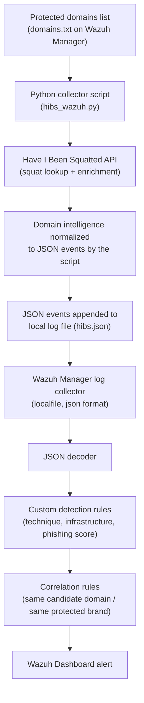
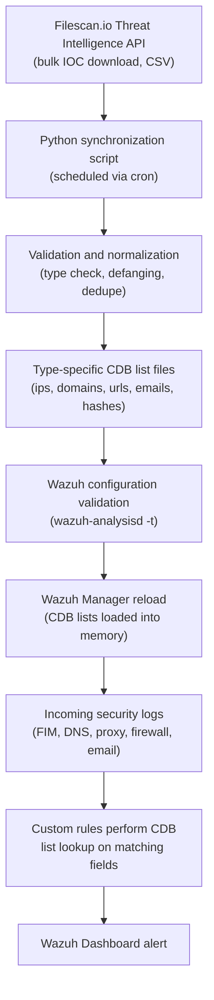
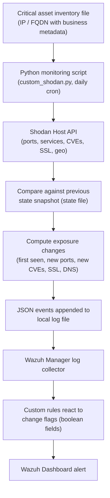
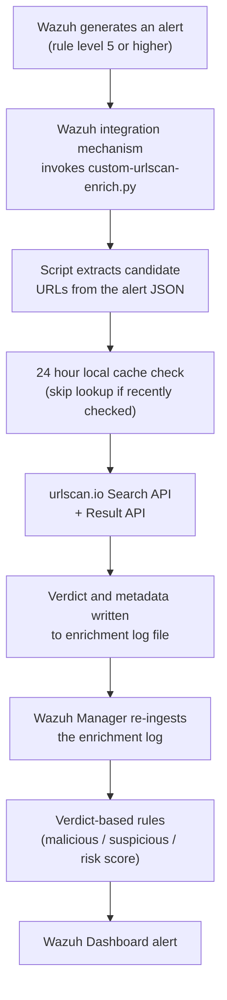
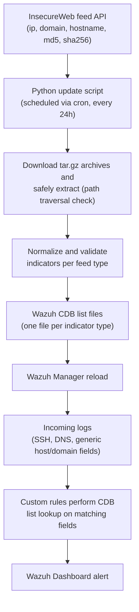
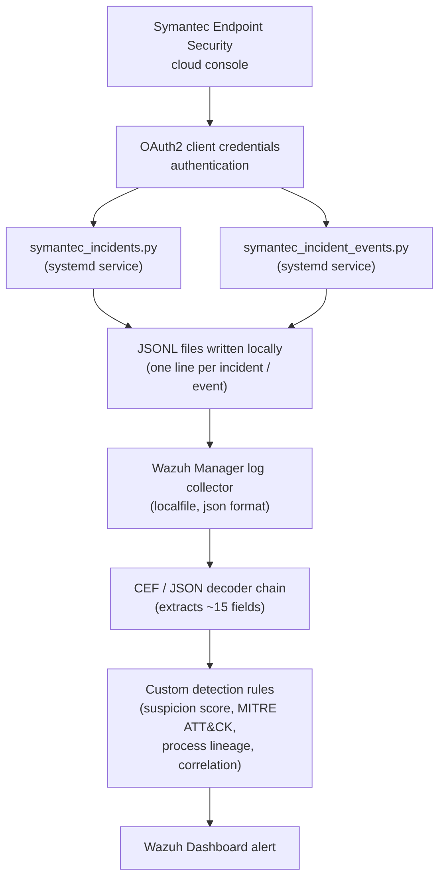
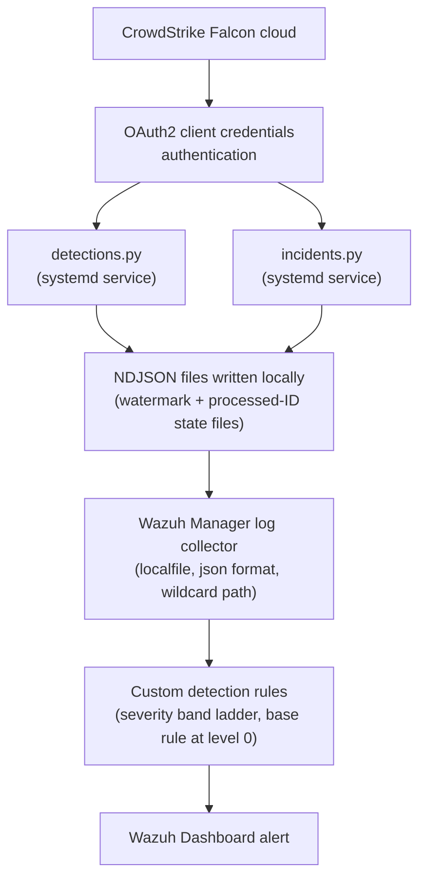
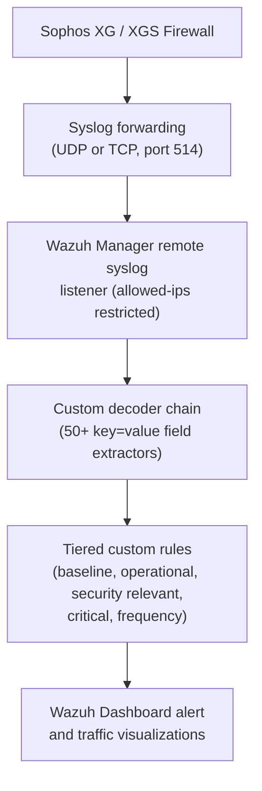

# External Intelligence and EDR/Firewall Integrations with Wazuh SIEM

### Research and Implementation Reference Document

**Scope:** knowledge reference and step by step implementation guide.
**Target platform:** single all-in-one Wazuh server (Manager, Indexer and Dashboard on one host), Ubuntu LTS.

---


---

## Table of Contents

- [1. Introduction](#1-introduction)
- [3. Have I Been Squatted (Typosquatting Detection)](#3-have-i-been-squatted-typosquatting-detection)
- [4. Filescan.io Threat Intelligence Ingestion](#4-filescanio-threat-intelligence-ingestion)
- [5. Shodan.io Attack Surface and IoT Monitoring](#5-shodanio-attack-surface-and-iot-monitoring)
- [6. urlscan.io Automated URL Reputation Enrichment](#6-urlscanio-automated-url-reputation-enrichment)
- [7. InsecureWeb Threat Intelligence Ingestion](#7-insecureweb-threat-intelligence-ingestion)
- [8. Symantec EDR Integration](#8-symantec-edr-integration)
- [9. CrowdStrike Falcon EDR Integration](#9-crowdstrike-falcon-edr-integration)
- [10. Sophos Firewall Integration](#10-sophos-firewall-integration)
- [11. Cross-Integration Comparison](#11-cross-integration-comparison)
- [12. Appendix: Consolidated Rule ID Map](#12-appendix-consolidated-rule-id-map)

---

---

# 1. Introduction

## 1.1 Purpose of this document

This document is a combined knowledge reference and implementation guide covering eight external data source integrations with Wazuh SIEM. Each integration was originally documented in a separate public blog post by the same author (Muhammad Moiz ud Din Rafay, Wazuh Ambassador). This document consolidates all eight into a single reference so the security team can use one source of truth both to understand what each integration does and to actually build it on our Wazuh server when the decision is made to do so.

This document is written for implementation, not casual reading. Every section contains complete, copy paste ready configuration, scripts, decoders and rules. Where the original source material contained an error, an insecure practice, or a design inconsistency, the issue has been corrected here, and the correction is explained side by side with the original so the reasoning is visible and auditable.

## 1.2 How to use this document

The document is organized into one major section per integration (Sections 3 through 10). Each of those sections is self contained and follows the same internal structure, so once you are familiar with one section you can navigate any other section the same way:

- Purpose: what problem the integration solves and why it might matter to us.
- Architecture diagram: a visual, step by step data flow from the external source through to a Wazuh alert.
- Getting access: how to obtain the account, API key or console access required, since our team does not currently hold accounts for any of these eight services.
- Applicability to us: a short note on whether this integration is directly usable with our current environment (single server, single client, no existing EDR or firewall vendor confirmed) or whether it depends on a future purchasing or tooling decision.
- Implementation steps: complete, ordered, copy paste ready commands, scripts, decoders and rules.
- Corrections made to the source material: a table listing every change made to the original blog code, with the original snippet, the corrected snippet, and the reason for the change.
- Testing and validation: how to confirm the integration is actually working before relying on it.

## 1.3 Placeholder convention

Because this document is meant to work for our environment without assuming any specific server names, IP addresses or account details, every value that must be supplied by whoever implements the integration is written in angle brackets, in capital letters, followed by a short description of exactly what belongs there. For example:

```
<WAZUH_MANAGER_IP> (the internal or public IP address of our Wazuh server)
<YOUR_API_KEY> (the API key generated from the vendor's own console)
<PROTECTED_DOMAIN> (a domain name that we own and want to monitor)
```

Before running any command, search the relevant step for angle bracket placeholders and replace them with our actual values. Nothing in angle brackets should ever be left in a file that is actually executed.

## 1.4 Rule numbering scheme

The eight source articles were written independently and their custom Wazuh rule IDs overlap. For example, both the Symantec EDR article and the CrowdStrike article use rule IDs in the 222200 to 222300 range for completely unrelated detections. If both rulesets were loaded onto the same Wazuh manager exactly as published, the second one loaded would either fail to load or silently overwrite rules from the first, because Wazuh rule IDs must be unique across the whole manager.

Our current custom ruleset is minimal, so there is no existing collision today, but that will not remain true once more than one of these integrations is deployed. To prevent this problem permanently, every rule in this document has been renumbered into its own dedicated block of one hundred IDs, all above 100000 to stay clear of Wazuh's own built in rule range and any small custom ruleset we already have. Each rule's position relative to the others inside its own integration is preserved exactly, only the numeric ID has shifted by a fixed amount, so all parent child relationships between rules (if_sid) and all correlation references (if_matched_sid) still work correctly.

| Integration | First rule ID in block | Last rule ID in block |
| --- | --- | --- |
| Have I Been Squatted (Section 3) | 100100 | 100199 |
| Filescan.io (Section 4) | 100200 | 100299 |
| Shodan.io (Section 5) | 100300 | 100399 |
| urlscan.io (Section 6) | 100400 | 100499 |
| InsecureWeb (Section 7) | 100500 | 100599 |
| Symantec EDR (Section 8) | 100600 | 100699 |
| CrowdStrike Falcon (Section 9) | 100700 | 100799 |
| Sophos Firewall (Section 10) | 100800 | 100899 |

> **Recommendation:** If any of these integrations are deployed, keep a note of the next free ID above 100899 for any future custom rule work, so this same collision problem does not reappear later.

## 1.5 What is and is not covered

This document was produced from eight published blog posts. It reproduces and corrects the technical content of those posts. It does not include vendor pricing, contractual terms, or a recommendation on which integrations to prioritize. Two of the eight integrations (Symantec EDR and CrowdStrike Falcon) both address the same category of tooling, endpoint detection and response, and two others (Filescan.io and InsecureWeb) both address bulk threat intelligence ingestion using the same underlying Wazuh mechanism (CDB lists). Where an integration depends on a vendor product we may not currently hold a license for, this is flagged clearly at the start of that section under Applicability to us, so the reader is never left assuming a tool is already available when it is not.

---

# 3. Have I Been Squatted (Typosquatting Detection)

## 3.1 Purpose

Attackers frequently register domains that look almost identical to a legitimate brand's domain, such as replacing a letter, adding a hyphen, or using a different top level domain. These lookalike domains are used for phishing, fake login pages, fraudulent email campaigns and brand impersonation. This is called typosquatting. Have I Been Squatted (HIBS) is an external service that continuously discovers these lookalike domains for a domain we choose to protect, and enriches each finding with DNS, WHOIS, IP, HTTP, SSL certificate and phishing risk information. This integration pulls that intelligence into Wazuh so a lookalike domain campaign against our brand becomes visible inside the same dashboard the security team already watches, instead of requiring a separate manual check on an external website.

## 3.2 Architecture



*Figure 3.1: Have I Been Squatted data flow into Wazuh*

A scheduled Python script reads a list of domains we own from a text file, queries the HIBS API once per domain, converts every returned intelligence event into a single line JSON record, and appends it to a log file. Wazuh reads that log file, decodes it as JSON, and a set of custom rules assign severity based on what kind of intelligence was found. A separate set of correlation rules raise the severity further when several signals land on the same lookalike domain, or when many lookalike domains target the same protected brand at once.

## 3.3 Applicability to us

> **Applicability:** This integration only requires a HIBS account and a domain we own. It does not depend on any other product or vendor decision, so it can be implemented as soon as the API key from Section 3.4 is obtained.

## 3.4 Getting access

1. Create an account at https://haveibeensquatted.com/.
2. Open the account dashboard and locate the API section, then generate a new API key.
3. Note the subscription tier attached to the account. The free or base tier returns basic squat candidate discovery only. GeoIP lookups, NXDOMAIN checks, WHOIS and RDAP registration intelligence, and phishing detection scoring require a paid Plus or Pro tier. If the account is on a lower tier, several of the rules in Section 3.7 below will simply never fire, which is expected behaviour and not a fault in the Wazuh configuration.
4. Copy the generated API key somewhere temporary and secure. It will be placed into a protected file on the Wazuh server in Section 3.5 and should not be pasted anywhere else, including chat messages, tickets, or shared documents.

## 3.5 Implementation steps

### Step 1: Store the API key outside the script

```bash
sudo mkdir -p /etc/hibs
sudo nano /etc/hibs/hibs.env
```

Add the following line, replacing the placeholder with the real key from Section 3.4:

```bash
HIBS_API_TOKEN=<YOUR_HIBS_API_KEY>
```

Restrict access to this file so only the root account can read it:

```bash
sudo chown root:root /etc/hibs/hibs.env
sudo chmod 600 /etc/hibs/hibs.env
```

### Step 2: Create the domain list to protect

```bash
sudo touch /etc/hibs/domains.txt
```

Edit the file with the following content, replacing the example with domains we actually own and are authorized to monitor:

```
# Have I Been Squatted protected domains.
# Enter one domain per line.

<PROTECTED_DOMAIN_1>
<PROTECTED_DOMAIN_2>

# Blank lines are ignored.
# Lines starting with a hash character are ignored entirely.
#
# A short trailing comment can be added after a domain on the same line,
# separated by whitespace, for example:
# <PROTECTED_DOMAIN_3>   secondary brand
```

> **Correction:** The example content in the original blog post used real, publicly known company domains (ebay.com and alibaba.com) as placeholders, along with several typos in the comment text ("aslo", "doamin", "Secondar"). Neither of those companies should ever be entered here unless we are specifically authorized to monitor them. The content above replaces those examples with clearly marked placeholders and corrects the comment wording, since this file will be read and edited directly by whoever runs the integration.

### Step 3: Create the Python collector script

```bash
sudo touch /var/ossec/integrations/hibs_wazuh.py
sudo chmod 750 /var/ossec/integrations/hibs_wazuh.py
sudo chown root:wazuh /var/ossec/integrations/hibs_wazuh.py
sudo nano /var/ossec/integrations/hibs_wazuh.py
```

Paste the following corrected script. Two data fidelity fixes have been applied relative to the source article, both explained in the corrections table in Section 3.6.

```python
#!/usr/bin/env python3

import argparse
import json
import os
import sys
import time

from datetime import datetime, timezone
from pathlib import Path
from typing import Any, Dict, Iterable, Optional
from urllib.error import HTTPError, URLError
from urllib.parse import quote
from urllib.request import Request, urlopen

API_BASE = "https://api.haveibeensquatted.com"

DEFAULT_ENV = "/etc/hibs/hibs.env"
DEFAULT_DOMAINS = "/etc/hibs/domains.txt"
DEFAULT_OUTPUT = "/var/log/hibs/hibs.json"


def utc_now():
    return (
        datetime.now(timezone.utc)
        .isoformat(timespec="seconds")
        .replace("+00:00", "Z")
    )


def load_env(path):
    values = {}
    env_file = Path(path)
    if not env_file.exists():
        return values
    for raw_line in env_file.read_text(encoding="utf-8").splitlines():
        line = raw_line.strip()
        if not line or line.startswith("#") or "=" not in line:
            continue
        key, value = line.split("=", 1)
        values[key.strip()] = value.strip().strip('"').strip("'")
    return values


def read_domains(path):
    domains = []
    lines = Path(path).read_text(encoding="utf-8").splitlines()
    for line_number, raw_line in enumerate(lines, start=1):
        line = raw_line.strip()
        if not line or line.startswith("#"):
            continue
        domain = line.split()[0].lower().rstrip(".")
        if "://" in domain or "/" in domain or "." not in domain:
            raise ValueError(f"Invalid domain at {path}:{line_number}: {raw_line}")
        domains.append(domain)
    return sorted(set(domains))


def find_domain(obj):
    preferred_keys = ("domain", "fqdn", "hostname", "name")
    if isinstance(obj, dict):
        for key in preferred_keys:
            value = obj.get(key)
            if isinstance(value, str) and "." in value and " " not in value:
                return value.lower().rstrip(".")
        for value in obj.values():
            found = find_domain(value)
            if found:
                return found
    elif isinstance(obj, list):
        for value in obj:
            found = find_domain(value)
            if found:
                return found
    return None


def first_value(obj, keys, default=""):
    wanted_keys = set(keys)
    if isinstance(obj, dict):
        for key, value in obj.items():
            if key in wanted_keys:
                return value
        for value in obj.values():
            found = first_value(value, keys, None)
            if found is not None:
                return found
    elif isinstance(obj, list):
        for value in obj:
            found = first_value(value, keys, None)
            if found is not None:
                return found
    return default


def collect_ips(obj):
    results = []
    if isinstance(obj, dict):
        ip_value = obj.get("ip")
        if isinstance(ip_value, str):
            results.append(ip_value)
        for key, value in obj.items():
            if isinstance(key, str):
                parts = key.split(".")
                if len(parts) == 4 and all(part.isdigit() for part in parts):
                    results.append(key)
            results.extend(collect_ips(value))
    elif isinstance(obj, list):
        for value in obj:
            results.extend(collect_ips(value))
    return sorted(set(results))


def to_float(value):
    try:
        return float(value)
    except (TypeError, ValueError):
        return 0.0


def _coerce_bool(value):
    # CORRECTED: accepts native booleans as well as common string
    # representations of true/false instead of silently discarding them.
    if isinstance(value, bool):
        return value
    if isinstance(value, str):
        if value.strip().lower() in ("true", "yes", "1"):
            return True
        if value.strip().lower() in ("false", "no", "0"):
            return False
    return ""


def normalize(protected_domain, message):
    operation = str(message.get("op", "unknown"))
    data = message.get("data", {})

    candidate_domain = (
        find_domain(data) or find_domain(message) or protected_domain
    )

    permutation = first_value(data, ("permutation", "fuzzer", "technique"), "")
    distance = first_value(data, ("distance", "edit_distance"), -1)
    registered = first_value(data, ("registered", "is_registered"), "")
    phishing_score = to_float(first_value(data, ("phishing_score", "phishing"), 0.0))

    ips = collect_ips(data)
    has_active_infrastructure = bool(ips)

    if phishing_score >= 0.80:
        phishing_risk = "critical"
    elif phishing_score >= 0.60:
        phishing_risk = "high"
    elif phishing_score >= 0.40:
        phishing_risk = "medium"
    else:
        phishing_risk = "low"

    is_candidate = (
        candidate_domain != protected_domain
        and operation.lower() not in ("meta", "progress")
    )

    event = {
        "integration": "haveibeensquatted",
        "event_type": "hibs_lookup",
        "timestamp": utc_now(),
        "protected_domain": protected_domain,
        "candidate_domain": candidate_domain,
        "is_candidate": is_candidate,
        "op": operation,
        "permutation": str(permutation),
        # CORRECTED: accepts int or float (excluding bool) instead of int only,
        # so a distance returned as a JSON float is no longer discarded.
        "distance": (
            int(distance)
            if isinstance(distance, (int, float)) and not isinstance(distance, bool)
            else -1
        ),
        # CORRECTED: uses _coerce_bool instead of a strict isinstance(bool) check.
        "registered": _coerce_bool(registered),
        "phishing_score": phishing_score,
        "phishing_risk": phishing_risk,
        "ip_count": len(ips),
        "has_active_infrastructure": has_active_infrastructure,
        "ips": ",".join(ips),
        "hibs_raw": message,
    }
    return event


def append_event(path, event):
    output_file = Path(path)
    output_file.parent.mkdir(parents=True, exist_ok=True)
    with output_file.open("a", encoding="utf-8") as file_handle:
        file_handle.write(json.dumps(event, separators=(",", ":"), ensure_ascii=False) + "\n")


def emit_health(path, domain, status, **extra):
    event = {
        "integration": "haveibeensquatted",
        "event_type": "hibs_health",
        "timestamp": utc_now(),
        "protected_domain": domain,
        "status": status,
        **extra,
    }
    append_event(path, event)


def lookup_domain(domain, token, output, timeout):
    encoded_domain = quote(domain, safe="")
    url = f"{API_BASE}/v1/lookup/squat/{encoded_domain}"
    request = Request(
        url,
        headers={
            "Authorization": f"Bearer {token}",
            "Accept": "application/x-ndjson, application/json",
            "User-Agent": "hibs-wazuh/1.0",
        },
        method="GET",
    )
    received = 0
    try:
        with urlopen(request, timeout=timeout) as response:
            for raw_line in response:
                line = raw_line.decode("utf-8", errors="replace").strip()
                if not line:
                    continue
                try:
                    message = json.loads(line)
                except json.JSONDecodeError:
                    continue
                if not isinstance(message, dict):
                    continue
                received += 1
                event = normalize(domain, message)
                if event["op"].lower() in ("meta", "progress"):
                    continue
                append_event(output, event)
        emit_health(output, domain, "success", messages_received=received)
    except HTTPError as error:
        emit_health(output, domain, "api_error", http_status=error.code)
    except URLError as error:
        emit_health(output, domain, "connection_error", error=str(error.reason))
    except Exception as error:
        emit_health(output, domain, "connection_error", error=type(error).__name__)


def main():
    parser = argparse.ArgumentParser()
    parser.add_argument("--env-file", default=DEFAULT_ENV)
    parser.add_argument("--domains-file", default=DEFAULT_DOMAINS)
    parser.add_argument("--output", default=DEFAULT_OUTPUT)
    parser.add_argument("--timeout", type=int, default=180)
    parser.add_argument("--delay", type=float, default=1.0)
    args = parser.parse_args()

    env_values = load_env(args.env_file)
    api_token = os.environ.get("HIBS_API_TOKEN") or env_values.get("HIBS_API_TOKEN")

    if not api_token:
        print("ERROR: HIBS_API_TOKEN not found", file=sys.stderr)
        return 2

    try:
        domains = read_domains(args.domains_file)
    except Exception as error:
        print(f"ERROR reading domains: {error}", file=sys.stderr)
        return 2

    if not domains:
        print("ERROR: no domains configured", file=sys.stderr)
        return 2

    for index, domain in enumerate(domains):
        print(f"[HIBS] Checking {domain}")
        lookup_domain(domain, api_token, args.output, args.timeout)
        if index < len(domains) - 1 and args.delay > 0:
            time.sleep(args.delay)

    return 0


if __name__ == "__main__":
    sys.exit(main())
```

### Step 4: Create the log directory

```bash
sudo mkdir -p /var/log/hibs
sudo touch /var/log/hibs/hibs.json
sudo chmod 640 /var/log/hibs/hibs.json
```

### Step 5: Register the log file with the Wazuh manager

Edit <WAZUH_INSTALL_PATH>/etc/ossec.conf (typically /var/ossec/etc/ossec.conf) and add the following inside the <ossec_config> block:

```xml
<!-- HIBS Log Location -->
<localfile>
  <location>/var/log/hibs/hibs.json</location>
  <log_format>json</log_format>
</localfile>
```

```bash
sudo systemctl restart wazuh-manager
```

### Step 6: Create the custom detection rules

Create a new rule file, for example /var/ossec/etc/rules/hibs_rules.xml (this can also be pasted through the Wazuh Dashboard rule editor under Server Management, Rules):

```xml
<group name="hibs,">

  <rule id="100100" level="3">
    <if_sid>86600</if_sid>
    <field name="integration">haveibeensquatted</field>
    <description>Have I Been Squatted monitoring event</description>
  </rule>

  <rule id="100101" level="5">
    <if_sid>100100</if_sid>
    <field name="event_type">hibs_lookup</field>
    <description>HIBS domain monitoring lookup detected</description>
  </rule>

  <rule id="100102" level="7">
    <if_sid>100101</if_sid>
    <field name="is_candidate">true</field>
    <description>Potential typosquatting domain detected</description>
  </rule>

  <rule id="100103" level="9">
    <if_sid>100102</if_sid>
    <field name="op">RegistrationMetadata</field>
    <description>Registration metadata found for typosquatting candidate</description>
  </rule>

  <rule id="100104" level="8">
    <if_sid>100102</if_sid>
    <field name="op">Rdap</field>
    <description>RDAP registration intelligence found for typosquatting candidate</description>
  </rule>

  <rule id="100105" level="10">
    <if_sid>100102</if_sid>
    <field name="op">GeoIp</field>
    <description>Typosquatting candidate resolved to Internet infrastructure</description>
  </rule>

  <rule id="100106" level="8">
    <if_sid>100102</if_sid>
    <field name="op">IpEnumeration</field>
    <description>IP enumeration detected for typosquatting candidate</description>
  </rule>

  <rule id="100107" level="8">
    <if_sid>100102</if_sid>
    <field name="op">Dns</field>
    <description>DNS infrastructure detected for typosquatting candidate</description>
  </rule>

  <rule id="100108" level="10">
    <if_sid>100102</if_sid>
    <field name="op">HttpBanner</field>
    <description>Web service detected on typosquatting candidate</description>
  </rule>

  <rule id="100109" level="11">
    <if_sid>100102</if_sid>
    <field name="op">CertificateTransparency</field>
    <description>Certificate Transparency activity detected for typosquatting candidate</description>
  </rule>

  <rule id="100110" level="7">
    <if_sid>100102</if_sid>
    <field name="op">PassiveDns</field>
    <description>Passive DNS intelligence detected for typosquatting candidate</description>
  </rule>

  <rule id="100111" level="5">
    <if_sid>100102</if_sid>
    <field name="op">DomainMetadata</field>
    <description>Domain metadata detected for typosquatting candidate</description>
  </rule>

  <rule id="100112" level="6">
    <if_sid>100102</if_sid>
    <field name="op">Levenshtein</field>
    <description>Domain similarity analysis detected for typosquatting candidate</description>
  </rule>

  <rule id="100113" level="11">
    <if_sid>100102</if_sid>
    <field name="has_active_infrastructure">true</field>
    <description>Active infrastructure detected for typosquatting candidate</description>
  </rule>

  <rule id="100120" level="10">
    <if_sid>100102</if_sid>
    <field name="hibs_raw.permutation.kind">Bitsquatting</field>
    <description>Bitsquatting attack against protected brand detected</description>
  </rule>

  <rule id="100121" level="9">
    <if_sid>100102</if_sid>
    <field name="hibs_raw.permutation.kind">Addition</field>
    <description>Character addition typosquatting domain detected</description>
  </rule>

  <rule id="100122" level="10">
    <if_sid>100102</if_sid>
    <field name="hibs_raw.permutation.kind">Homoglyph</field>
    <description>Homoglyph brand impersonation domain detected</description>
  </rule>

  <rule id="100123" level="9">
    <if_sid>100102</if_sid>
    <field name="hibs_raw.permutation.kind">Omission</field>
    <description>Character omission typosquatting domain detected</description>
  </rule>

  <rule id="100124" level="8">
    <if_sid>100102</if_sid>
    <field name="hibs_raw.permutation.kind">Tld</field>
    <description>TLD variation typosquatting domain detected</description>
  </rule>

  <rule id="100125" level="9">
    <if_sid>100102</if_sid>
    <field name="hibs_raw.permutation.kind">FauxTld</field>
    <description>Faux TLD brand impersonation domain detected</description>
  </rule>

  <rule id="100130" level="10">
    <if_sid>100102</if_sid>
    <field name="phishing_risk">high</field>
    <description>High phishing risk associated with typosquatting candidate</description>
  </rule>

  <rule id="100131" level="14">
    <if_sid>100102</if_sid>
    <field name="phishing_risk">critical</field>
    <description>Critical phishing risk associated with typosquatting candidate</description>
  </rule>

  <!-- ================================================ -->
  <!-- CORRELATION RULES                                 -->
  <!-- ================================================ -->

  <rule id="100140" level="12" frequency="2" timeframe="300">
    <if_matched_sid>100102</if_matched_sid>
    <same_field>candidate_domain</same_field>
    <description>Multiple HIBS threat signals detected for the same typosquatting domain</description>
  </rule>

  <rule id="100141" level="13" frequency="3" timeframe="600">
    <if_matched_sid>100102</if_matched_sid>
    <same_field>candidate_domain</same_field>
    <description>Multiple enrichment signals detected for the same typosquatting domain</description>
  </rule>

  <rule id="100142" level="14" frequency="5" timeframe="900">
    <if_matched_sid>100102</if_matched_sid>
    <same_field>candidate_domain</same_field>
    <description>High confidence typosquatting campaign activity detected for same domain</description>
  </rule>

  <rule id="100143" level="12" frequency="3" timeframe="600">
    <if_matched_sid>100105</if_matched_sid>
    <same_field>candidate_domain</same_field>
    <description>Multiple active IP infrastructure observations detected for same typosquatting domain</description>
  </rule>

  <rule id="100144" level="13" frequency="2" timeframe="600">
    <if_matched_sid>100108</if_matched_sid>
    <same_field>candidate_domain</same_field>
    <description>Repeated web service activity detected for same typosquatting domain</description>
  </rule>

  <rule id="100145" level="14" frequency="2" timeframe="900">
    <if_matched_sid>100109</if_matched_sid>
    <same_field>candidate_domain</same_field>
    <description>Repeated certificate activity detected for same typosquatting domain</description>
  </rule>

  <rule id="100146" level="13" frequency="3" timeframe="900">
    <if_matched_sid>100120</if_matched_sid>
    <same_field>protected_domain</same_field>
    <description>Multiple bitsquatting detections targeting the same protected brand</description>
  </rule>

  <rule id="100147" level="13" frequency="5" timeframe="900">
    <if_matched_sid>100102</if_matched_sid>
    <same_field>protected_domain</same_field>
    <description>Multiple typosquatting candidates targeting the same protected brand</description>
  </rule>

  <rule id="100148" level="15" frequency="10" timeframe="1800">
    <if_matched_sid>100102</if_matched_sid>
    <same_field>protected_domain</same_field>
    <description>Large typosquatting campaign targeting protected brand detected</description>
  </rule>

</group>
```

```bash
sudo systemctl restart wazuh-manager
```

### Step 7: Run the collector manually to test

```bash
sudo python3 /var/ossec/integrations/hibs_wazuh.py
```

This will print a line for each domain being checked. Once complete, JSON events will have been appended to /var/log/hibs/hibs.json and Wazuh should generate alerts as described in Section 3.7.

### Step 8: Automate with cron

Once the manual test succeeds, schedule the script to run automatically, for example every six hours:

```bash
sudo crontab -e

# add this line:
0 */6 * * * root /usr/bin/python3 /var/ossec/integrations/hibs_wazuh.py --env-file /etc/hibs/hibs.env --domains-file /etc/hibs/domains.txt --output /var/log/hibs/hibs.json >> /var/log/hibs/cron.log 2>&1
```

Choose an interval based on how many domains are in domains.txt, the account's API rate limits, and how quickly we need to know about a new lookalike domain. Checking every six hours is a reasonable starting point for a small number of protected domains.

## 3.6 Corrections made to the source material

The following changes were made to the script published in the original blog post. None of these change the overall design of the integration, they only correct data handling edge cases that would otherwise silently discard valid intelligence.

**Correction 1**

Original (from source article):

```
distance:
    distance
    if isinstance(
        distance,
        int,
    )
    else -1,
```

Corrected version:

```
"distance": (
    int(distance)
    if isinstance(distance, (int, float))
    and not isinstance(distance, bool)
    else -1
),
```

*Why this was changed:* The original check only accepted a Python int. If the HIBS API returned the edit distance as a JSON number that Python parsed as a float (for example 2.0), the original code discarded a real, valid value and silently replaced it with -1. The corrected version accepts both int and float, explicitly excludes booleans (since bool is a subclass of int in Python and could otherwise slip through as a false distance of 0 or 1), and always stores a clean integer.

**Correction 2**

Original (from source article):

```
registered:
    registered
    if isinstance(
        registered,
        bool,
    )
    else "",
```

Corrected version:

```
"registered": _coerce_bool(registered),

# helper added near the top of the script:
def _coerce_bool(value):
    if isinstance(value, bool):
        return value
    if isinstance(value, str):
        if value.strip().lower() in ("true", "yes", "1"):
            return True
        if value.strip().lower() in ("false", "no", "0"):
            return False
    return ""
```

*Why this was changed:* The original check only accepted a native Python boolean. Some upstream APIs represent boolean fields as the strings "true" or "false" rather than a JSON boolean, especially inside nested vendor specific payloads. The original code would silently drop that value to an empty string, which is exactly the kind of information loss the severity rules in Section 3.7 depend on avoiding. The corrected helper normalizes common string and boolean representations before storing the value.

**Correction 3**

Original (from source article):

```
ebay.com
alibaba.com - You can add you doamin

#anotherbrand.com # Secondar brand
```

Corrected version:

```
<PROTECTED_DOMAIN_1>
<PROTECTED_DOMAIN_2>

# <PROTECTED_DOMAIN_3>   secondary brand
```

*Why this was changed:* The original example file used two real, publicly known companies as sample data and contained three spelling errors in the comment text. Since this file is meant to be edited directly by our team, it has been replaced with clearly marked placeholders and corrected wording so nobody accidentally monitors a domain we do not own.

## 3.7 Suggested severity model

The rule set in Step 6 follows a progressive severity model so that discovering a lookalike domain does not, by itself, immediately page anyone. Severity increases as more concrete evidence of real, active infrastructure accumulates.

| Tier | Example signal | New rule ID range |
| --- | --- | --- |
| Informational / low | Domain metadata collected, similarity calculation completed, passive DNS information | 100100 - 100107, 100110 - 100112 |
| Medium | Typosquatting candidate identified, DNS records discovered, RDAP information available | 100102, 100107 |
| High | Registration metadata exists, bitsquatting or homoglyph technique detected, active IP infrastructure, HTTP service detected | 100103, 100108, 100113, 100120, 100122, 100124 |
| Very high / critical | Certificate activity, high or critical phishing risk score, multiple signals on one candidate, multiple candidates targeting the same brand | 100109, 100130, 100131, 100140 - 100148 |

## 3.8 Testing and validation

1. Run the script manually as shown in Step 7 and confirm it prints one "Checking <domain>" line per domain in domains.txt without errors.
2. Confirm new lines appear in /var/log/hibs/hibs.json: tail -f /var/log/hibs/hibs.json
3. In the Wazuh Dashboard, open Discover (or Threat Hunting) and filter on rule.groups: hibs to confirm events are being indexed.
4. Confirm at least the base rule (100100) and the candidate rule (100102) are firing. If GeoIP, RDAP or phishing score rules never fire, check the HIBS account tier before assuming the Wazuh configuration is broken, as noted in Section 3.4.
5. Optionally add a domain to domains.txt that is known to already have public lookalikes, to confirm the full pipeline end to end before relying on it for a domain that matters operationally.

---

# 4. Filescan.io Threat Intelligence Ingestion

## 4.1 Purpose

Filescan.io publishes a bulk feed of indicators of compromise (IOCs) covering malicious file hashes, IP addresses, domains, URLs and email addresses. Without this integration, an analyst who sees a suspicious IP, domain or file hash inside a Wazuh alert has to manually copy it out and check it against an external threat intelligence source one item at a time. This integration downloads Filescan.io's feed on a schedule, stores it locally on the Wazuh manager as lookup lists, and adds custom rules so that any log Wazuh already receives, from firewalls, DNS servers, proxies, endpoint file integrity monitoring or mail servers, is automatically checked against that feed with no per event external API call required.

## 4.2 Architecture



*Figure 4.1: Filescan.io data flow into Wazuh*

A scheduled Python script downloads the feed as CSV, validates and normalizes every indicator, and writes five separate CDB (constant database) list files, one per indicator type. Wazuh loads these list files into memory when it starts or reloads. Ordinary rules then check specific fields in every incoming log line, such as the source IP or the DNS query name, against the appropriate list. A match produces an immediate alert without needing to contact Filescan.io again.

## 4.3 Applicability to us

> **Applicability:** This integration requires a Filescan.io account with API access to the bulk feed endpoint. It does not depend on any other vendor or product, so it can be implemented independently.

## 4.4 Getting access

1. Create an account at https://www.filescan.io/.
2. Open account settings and generate an API key.
3. Confirm the account's plan includes the bulk threat intelligence feed endpoint used in Section 4.5. Some enrichment fields and higher feed volumes are limited to paid tiers.

## 4.5 Implementation steps

### Step 1: Store the API key

```bash
sudo mkdir -p /etc/filescan
sudo nano /etc/filescan/filescan.env
```

```bash
FILESCAN_API_KEY=<YOUR_FILESCAN_API_KEY>
```

```bash
sudo chown root:root /etc/filescan/filescan.env
sudo chmod 600 /etc/filescan/filescan.env
```

### Step 2: Prepare the Wazuh CDB list directory

```bash
sudo mkdir -p /var/ossec/etc/lists/filescan
sudo chown -R root:wazuh /var/ossec/etc/lists/filescan
sudo chmod 750 /var/ossec/etc/lists/filescan
```

### Step 3: Create the synchronization script

```bash
sudo touch /var/ossec/integrations/filescan_sync.py
sudo chmod 750 /var/ossec/integrations/filescan_sync.py
sudo chown root:wazuh /var/ossec/integrations/filescan_sync.py
sudo nano /var/ossec/integrations/filescan_sync.py
```

```python
#!/usr/bin/env python3

import argparse
import csv
import ipaddress
import io
import os
import re
import sys

from pathlib import Path
from urllib.error import HTTPError, URLError
from urllib.request import Request, urlopen

FEED_URL = "https://api.filescan.io/api/threat-intel/bulk-feed"

LIST_DIR = Path("/var/ossec/etc/lists/filescan")

IOC_LIST_FILES = {
    "ip": "filescan-ips",
    "domain": "filescan-domains",
    "url": "filescan-urls",
    "email": "filescan-emails",
    "md5": "filescan-hashes",
    "sha1": "filescan-hashes",
    "sha256": "filescan-hashes",
    "sha512": "filescan-hashes",
}

IOC_TYPE_ALIASES = {
    "ips": "ip",
    "ip_address": "ip",
    "ip_addresses": "ip",
    "domains": "domain",
    "hostname": "domain",
    "urls": "url",
    "emails": "email",
    "email_address": "email",
}

HASH_LENGTHS = {"md5": 32, "sha1": 40, "sha256": 64, "sha512": 128}
HEX_PATTERN = re.compile(r"^[0-9a-f]+$")


def load_env(path):
    values = {}
    env_file = Path(path)
    if not env_file.exists():
        return values
    for raw_line in env_file.read_text(encoding="utf-8").splitlines():
        line = raw_line.strip()
        if not line or line.startswith("#") or "=" not in line:
            continue
        key, value = line.split("=", 1)
        values[key.strip()] = value.strip().strip('"').strip("'")
    return values


def normalize_type(raw_type):
    raw_type = (raw_type or "").strip().lower()
    return IOC_TYPE_ALIASES.get(raw_type, raw_type)


def normalize_ip(value):
    value = value.strip()
    try:
        ipaddress.ip_address(value)
        return value
    except ValueError:
        return None


def normalize_domain(value):
    value = value.strip().lower().rstrip(".")
    if not value or " " in value or "/" in value:
        return None
    try:
        value = value.encode("idna").decode("ascii")
    except Exception:
        pass
    return value


def normalize_url(value):
    value = value.strip()
    value = value.replace("hxxp://", "http://").replace("hxxps://", "https://")
    value = value.replace("[.]", ".").replace("[:]", ":")
    if not value:
        return None
    return value


def normalize_email(value):
    value = value.strip().lower()
    if "@" not in value:
        return None
    return value


def normalize_hash(ioc_type, value):
    value = value.strip()
    expected_length = HASH_LENGTHS.get(ioc_type)
    if expected_length is None:
        return None
    if len(value) != expected_length:
        return None
    if not HEX_PATTERN.fullmatch(value.lower()):
        return None
    return value.lower()


def normalize_value(ioc_type, raw_value):
    if ioc_type == "ip":
        return normalize_ip(raw_value)
    if ioc_type == "domain":
        return normalize_domain(raw_value)
    if ioc_type == "url":
        return normalize_url(raw_value)
    if ioc_type == "email":
        return normalize_email(raw_value)
    if ioc_type in HASH_LENGTHS:
        return normalize_hash(ioc_type, raw_value)
    return None


def escape_cdb_key(value):
    return value.replace(":", "\\:").replace("\\", "\\\\")


def render_cdb(values):
    lines = []
    for value in sorted(values):
        cdb_key = escape_cdb_key(value)
        lines.append(f"{cdb_key}:malicious")
    if not lines:
        return None
    return "\n".join(lines) + "\n"


def write_cdb_list(dest_name, values):
    dest = LIST_DIR / dest_name
    content = render_cdb(values)
    if content is None:
        # CORRECTED: do not overwrite an existing good list with an empty one.
        print(
            f"WARNING: zero indicators parsed for {dest_name}, "
            f"skipping write to avoid wiping existing list",
            file=sys.stderr,
        )
        return
    tmp_path = dest.with_suffix(".tmp")
    tmp_path.write_text(content, encoding="utf-8")
    os.chmod(tmp_path, 0o640)
    os.replace(tmp_path, dest)


def fetch_feed(api_key, timeout):
    request = Request(
        FEED_URL,
        headers={
            "Authorization": f"Bearer {api_key}",
            "Accept": "text/csv",
            "User-Agent": "filescan-wazuh-sync/1.0",
        },
        method="GET",
    )
    with urlopen(request, timeout=timeout) as response:
        return response.read().decode("utf-8", errors="replace")


def main():
    parser = argparse.ArgumentParser()
    parser.add_argument("--env-file", default="/etc/filescan/filescan.env")
    parser.add_argument("--timeout", type=int, default=300)
    args = parser.parse_args()

    env_values = load_env(args.env_file)
    # CORRECTED: loaded from environment / env file rather than hardcoded
    # directly in this source file.
    api_key = os.environ.get("FILESCAN_API_KEY") or env_values.get("FILESCAN_API_KEY")
    if not api_key:
        print("ERROR: FILESCAN_API_KEY not set", file=sys.stderr)
        return 2

    try:
        raw_csv = fetch_feed(api_key, args.timeout)
    except (HTTPError, URLError) as error:
        print(f"ERROR fetching feed: {error}", file=sys.stderr)
        return 2

    LIST_DIR.mkdir(parents=True, exist_ok=True)

    buckets = {name: set() for name in set(IOC_LIST_FILES.values())}

    reader = csv.DictReader(io.StringIO(raw_csv))
    for row in reader:
        raw_type = row.get("type") or row.get("ioc_type") or ""
        raw_value = row.get("value") or row.get("indicator") or ""
        if not raw_value:
            continue
        ioc_type = normalize_type(raw_type)
        if ioc_type not in IOC_LIST_FILES:
            continue
        normalized = normalize_value(ioc_type, raw_value)
        if not normalized:
            continue
        buckets[IOC_LIST_FILES[ioc_type]].add(normalized)

    for dest_name, values in buckets.items():
        write_cdb_list(dest_name, values)
        print(f"{dest_name}: {len(values)} indicators")

    return 0


if __name__ == "__main__":
    sys.exit(main())
```

### Step 4: Register the CDB lists with the Wazuh manager

Add the following inside <ossec_config> in ossec.conf:

```xml
<!-- Filescan.io threat intelligence lists -->
<ruleset>
  <list>etc/lists/filescan/filescan-ips</list>
  <list>etc/lists/filescan/filescan-domains</list>
  <list>etc/lists/filescan/filescan-urls</list>
  <list>etc/lists/filescan/filescan-emails</list>
  <list>etc/lists/filescan/filescan-hashes</list>
</ruleset>
```

### Step 5: Create the detection rules

```xml
<group name="filescan,threat_intel,">

  <rule id="100200" level="12">
    <list field="srcip" lookup="address_match_key">etc/lists/filescan/filescan-ips</list>
    <description>Filescan.io malicious source IP detected: $(srcip)</description>
    <group>filescan_ioc,network_ioc,</group>
  </rule>

  <rule id="100201" level="12">
    <list field="dstip" lookup="address_match_key">etc/lists/filescan/filescan-ips</list>
    <description>Filescan.io malicious destination IP detected: $(dstip)</description>
    <group>filescan_ioc,network_ioc,</group>
  </rule>

  <rule id="100210" level="11">
    <list field="domain" lookup="match_key">etc/lists/filescan/filescan-domains</list>
    <description>Filescan.io malicious domain detected: $(domain)</description>
    <group>filescan_ioc,domain_ioc,</group>
  </rule>

  <rule id="100211" level="11">
    <list field="dns.question.name" lookup="match_key">etc/lists/filescan/filescan-domains</list>
    <description>Filescan.io malicious DNS query detected: $(dns.question.name)</description>
    <group>filescan_ioc,domain_ioc,</group>
  </rule>

  <rule id="100212" level="11">
    <list field="data.win.eventdata.queryName" lookup="match_key">etc/lists/filescan/filescan-domains</list>
    <description>Filescan.io malicious DNS query detected (Sysmon): $(data.win.eventdata.queryName)</description>
    <group>filescan_ioc,domain_ioc,</group>
  </rule>

  <rule id="100220" level="11">
    <list field="url" lookup="match_key">etc/lists/filescan/filescan-urls</list>
    <description>Filescan.io malicious URL detected: $(url)</description>
    <group>filescan_ioc,url_ioc,</group>
  </rule>

  <rule id="100221" level="11">
    <list field="data.web.url" lookup="match_key">etc/lists/filescan/filescan-urls</list>
    <description>Filescan.io malicious URL detected (proxy): $(data.web.url)</description>
    <group>filescan_ioc,url_ioc,</group>
  </rule>

  <rule id="100230" level="10">
    <list field="data.email.from" lookup="match_key">etc/lists/filescan/filescan-emails</list>
    <description>Filescan.io malicious sender address detected: $(data.email.from)</description>
    <group>filescan_ioc,email_ioc,</group>
  </rule>

  <rule id="100231" level="10">
    <list field="data.email.to" lookup="match_key">etc/lists/filescan/filescan-emails</list>
    <description>Filescan.io malicious recipient address detected: $(data.email.to)</description>
    <group>filescan_ioc,email_ioc,</group>
  </rule>

  <rule id="100240" level="12">
    <list field="md5" lookup="match_key">etc/lists/filescan/filescan-hashes</list>
    <description>Filescan.io malicious MD5 hash detected: $(md5)</description>
    <group>filescan_ioc,hash_ioc,</group>
  </rule>

  <rule id="100241" level="12">
    <list field="sha1" lookup="match_key">etc/lists/filescan/filescan-hashes</list>
    <description>Filescan.io malicious SHA1 hash detected: $(sha1)</description>
    <group>filescan_ioc,hash_ioc,</group>
  </rule>

  <rule id="100242" level="12">
    <list field="sha256" lookup="match_key">etc/lists/filescan/filescan-hashes</list>
    <description>Filescan.io malicious SHA256 hash detected: $(sha256)</description>
    <group>filescan_ioc,hash_ioc,</group>
  </rule>

  <rule id="100243" level="12">
    <list field="syscheck.md5_after" lookup="match_key">etc/lists/filescan/filescan-hashes</list>
    <description>Filescan.io malicious file detected via FIM (MD5): $(syscheck.path)</description>
    <group>filescan_ioc,hash_ioc,</group>
  </rule>

  <rule id="100244" level="12">
    <list field="syscheck.sha256_after" lookup="match_key">etc/lists/filescan/filescan-hashes</list>
    <description>Filescan.io malicious file detected via FIM (SHA256): $(syscheck.path)</description>
    <group>filescan_ioc,hash_ioc,</group>
  </rule>

</group>
```

```bash
sudo /var/ossec/bin/wazuh-analysisd -t
sudo systemctl restart wazuh-manager
```

### Step 6: Run the sync script manually

```bash
sudo python3 /var/ossec/integrations/filescan_sync.py --env-file /etc/filescan/filescan.env
```

Confirm the CDB list files were created and are non empty:

```bash
ls -la /var/ossec/etc/lists/filescan/
```

### Step 7: Automate with cron

```bash
sudo crontab -e

# add this line to sync once per day at 02:15:
15 2 * * * root /usr/bin/python3 /var/ossec/integrations/filescan_sync.py --env-file /etc/filescan/filescan.env >> /var/log/filescan_sync.log 2>&1
```

## 4.6 Corrections made to the source material

**Correction 1**

Original (from source article):

```
FILESCAN_API_KEY = "PASTE_YOUR_FILESCAN_API_KEY_HERE"
```

Corrected version:

```
# Read from the environment / env file instead of being hardcoded:
api_key = os.environ.get("FILESCAN_API_KEY") or env_values.get("FILESCAN_API_KEY")
if not api_key:
    print("ERROR: FILESCAN_API_KEY not set", file=sys.stderr)
    sys.exit(2)
```

*Why this was changed:* The published script placed the literal API key variable directly in the source file with a placeholder comment warning not to publish the real key. A key stored this way is at real risk of being committed to version control or left in a file with weaker permissions than the dedicated env file used elsewhere in this same integration. The corrected version loads the key the same way every other integration in this document does, from a root owned, chmod 600 environment file, so there is one consistent, auditable pattern across all eight integrations rather than a weaker one just for this script.

**Correction 2**

Original (from source article):

```
if len(values) == 0:
    write_cdb(dest, values)
```

Corrected version:

```
if len(values) == 0:
    print(f"WARNING: zero indicators parsed for {dest.name}, skipping write to avoid wiping existing list", file=sys.stderr)
    continue
write_cdb(dest, values)
```

*Why this was changed:* If the Filescan.io feed endpoint ever returned an empty or malformed response for one indicator type (for example a temporary API issue), the original script would still overwrite the previous, good CDB list with an empty one, silently disabling detection for that entire indicator type until the next successful sync. The corrected version keeps the previous list file untouched and only logs a warning when zero valid indicators were parsed, matching the safer behaviour already used by the InsecureWeb integration in Section 7.

## 4.7 Field mapping reference

Because different log sources name the same concept differently, several rules exist purely to point the same CDB list at a different field name. Use this table to confirm coverage for the log sources we actually have.

| Indicator type | CDB list file | Fields checked | New rule IDs |
| --- | --- | --- | --- |
| IP address | filescan-ips | srcip, dstip | 100200, 100201 |
| Domain | filescan-domains | domain, dns.question.name, data.win.eventdata.queryName | 100210, 100211, 100212 |
| URL | filescan-urls | url, data.web.url | 100220, 100221 |
| Email address | filescan-emails | data.email.from, data.email.to | 100230, 100231 |
| File hash (md5/sha1/sha256/sha512) | filescan-hashes | md5, sha1, sha256, syscheck.md5_after, syscheck.sha256_after | 100240 - 100244 |

## 4.8 Testing and validation

1. After Step 6, confirm each CDB file has more than one line: wc -l /var/ossec/etc/lists/filescan/*
2. Pick one real indicator from a list, for example a domain from filescan-domains, and generate a test DNS query log entry containing that exact domain on a monitored endpoint.
3. Confirm a Wazuh alert is generated citing one of the rule IDs in Section 4.7, and that the alert description includes the matched value.
4. Repeat with a value that is deliberately not in any list, and confirm no alert is generated, to rule out an overly broad rule condition.

---

# 5. Shodan.io Attack Surface and IoT Monitoring

## 5.1 Purpose

Shodan.io continuously scans the public internet and records what services, ports and certificates are visible on any given IP address or hostname. This integration uses Shodan to monitor a list of assets we consider critical, such as our Wazuh server itself, our public website, or any other public facing IP or domain. Rather than reporting everything Shodan sees every time, the integration compares each day's result against the previous day's result and only raises an alert when something actually changed, for example a new port opening, a new CVE appearing against a known service, or an asset becoming publicly visible for the first time. This gives us a way to notice unintended exposure of our own infrastructure quickly, rather than discovering it after it has already been used against us.

## 5.2 Architecture



*Figure 5.1: Shodan.io data flow into Wazuh*

A daily scheduled Python script reads our list of critical assets, queries the Shodan Host API for each one, and compares the result against a saved state file from the previous run. Differences are converted into boolean flags such as first_appeared_in_shodan or became_exposed, and written as JSON events to a log file. Wazuh reads that file and a flat set of rules translate each boolean flag directly into an alert level. A separate health check confirms the script itself is running on schedule and that the API key is still valid.

## 5.3 Applicability to us

> **Applicability:** This integration only needs a Shodan account and a list of IPs or hostnames we own, such as the public IP of the Hostinger VPS this Wazuh server runs on. It does not depend on any other vendor decision.

## 5.4 Getting access

1. Create an account at https://www.shodan.io/.
2. Open the account page and copy the API key shown there.
3. Note the plan's query credit allowance. The Host API lookup used by this integration consumes one query credit per asset per run, so the number of assets we monitor and how often we run the script should stay comfortably under the plan's daily or monthly allowance.

## 5.5 Implementation steps

### Step 1: Store the API key

```bash
sudo mkdir -p /etc/shodan
sudo nano /etc/shodan/shodan.env
```

```bash
SHODAN_API_KEY=<YOUR_SHODAN_API_KEY>
```

```bash
sudo chown root:root /etc/shodan/shodan.env
sudo chmod 600 /etc/shodan/shodan.env
```

### Step 2: Create the critical asset inventory

```bash
sudo nano /etc/shodan/assets.csv
```

```
# asset,description,owner,criticality
<WAZUH_MANAGER_PUBLIC_IP>,Wazuh SIEM server,Security Team,critical
<PUBLIC_WEBSITE_IP_OR_DOMAIN>,Public website,IT Team,high
```

> **Note:** Only add assets we actually own or are explicitly authorized to scan information about. Shodan itself does not scan on our behalf when we query it, it only returns what it has already observed from its own independent internet wide scanning, so this is safe to use even for a single server, but the list should still stay limited to assets that are genuinely ours.

### Step 3: Create the monitoring script

```bash
sudo touch /var/ossec/integrations/shodan_monitor.py
sudo chmod 750 /var/ossec/integrations/shodan_monitor.py
sudo chown root:wazuh /var/ossec/integrations/shodan_monitor.py
sudo nano /var/ossec/integrations/shodan_monitor.py
```

```python
#!/usr/bin/env python3

import argparse
import csv
import hashlib
import json
import os
import sys

from datetime import datetime, timezone
from pathlib import Path
from urllib.error import HTTPError, URLError
from urllib.request import Request, urlopen

API_BASE = "https://api.shodan.io"
STATE_DIR = Path("/var/lib/shodan")
MISSING_RUN_THRESHOLD_HOURS = 26


def utc_now():
    return datetime.now(timezone.utc).isoformat(timespec="seconds").replace("+00:00", "Z")


def load_env(path):
    values = {}
    env_file = Path(path)
    if not env_file.exists():
        return values
    for raw_line in env_file.read_text(encoding="utf-8").splitlines():
        line = raw_line.strip()
        if not line or line.startswith("#") or "=" not in line:
            continue
        key, value = line.split("=", 1)
        values[key.strip()] = value.strip().strip('"').strip("'")
    return values


def read_assets(path):
    assets = []
    with open(path, newline="", encoding="utf-8") as file_handle:
        reader = csv.DictReader(
            (line for line in file_handle if not line.strip().startswith("#"))
        )
        for row in reader:
            asset = (row.get("asset") or "").strip()
            if asset:
                assets.append(row)
    return assets


def sha256_json(obj):
    encoded = json.dumps(obj, sort_keys=True, separators=(",", ":")).encode("utf-8")
    return hashlib.sha256(encoded).hexdigest()


def exposure_fingerprint(snapshot):
    return sha256_json({
        "exposed": snapshot.get("exposed"),
        "open_ports": snapshot.get("open_ports", []),
        "vulnerabilities": snapshot.get("vulnerabilities", []),
        "service_fingerprints": snapshot.get("service_fingerprints", []),
        "ssl_fingerprints": snapshot.get("ssl_fingerprints", []),
    })


def diff_lists(old, new):
    # CORRECTED: cast both sides to string before building sets, so that a
    # value returned as an int on one run and a str on another (which the
    # Shodan API does occasionally for ports/CVE identifiers) is not reported
    # as a false add-and-remove pair.
    old_set = set(str(v) for v in (old or []))
    new_set = set(str(v) for v in (new or []))
    return {
        "added": sorted(new_set - old_set),
        "removed": sorted(old_set - new_set),
    }


def query_shodan(target, api_key, timeout):
    url = f"{API_BASE}/shodan/host/{target}?key={api_key}"
    request = Request(url, headers={"User-Agent": "shodan-wazuh/1.0"}, method="GET")
    with urlopen(request, timeout=timeout) as response:
        return json.loads(response.read().decode("utf-8"))


def build_snapshot(raw):
    return {
        "exposed": True,
        "open_ports": raw.get("ports", []),
        "vulnerabilities": sorted((raw.get("vulns") or {}).keys()),
        "service_fingerprints": sorted(set(
            f"{item.get('port')}/{item.get('transport', 'tcp')}"
            for item in raw.get("data", [])
        )),
        "ssl_fingerprints": sorted(set(
            item.get("ssl", {}).get("cert", {}).get("fingerprint", {}).get("sha256", "")
            for item in raw.get("data", [])
            if item.get("ssl")
        )),
        "org": raw.get("org", ""),
        "last_update": raw.get("last_update", ""),
    }


def load_state(asset_key):
    path = STATE_DIR / f"{asset_key}.json"
    if not path.exists():
        return None
    try:
        return json.loads(path.read_text(encoding="utf-8"))
    except json.JSONDecodeError:
        return None


def save_state(asset_key, snapshot):
    STATE_DIR.mkdir(parents=True, exist_ok=True)
    path = STATE_DIR / f"{asset_key}.json"
    tmp_path = path.with_suffix(".tmp")
    tmp_path.write_text(json.dumps(snapshot), encoding="utf-8")
    os.replace(tmp_path, path)


def append_event(path, event):
    output_file = Path(path)
    output_file.parent.mkdir(parents=True, exist_ok=True)
    with output_file.open("a", encoding="utf-8") as file_handle:
        file_handle.write(json.dumps(event, separators=(",", ":")) + "\n")


def process_asset(row, api_key, output, timeout):
    target = row["asset"]
    asset_key = target.replace(".", "_").replace(":", "_")
    previous_snapshot = load_state(asset_key) or {}
    previous_fp = previous_snapshot.get("_fingerprint")

    try:
        raw = query_shodan(target, api_key, timeout)
        snapshot = build_snapshot(raw)
        current_fp = exposure_fingerprint(snapshot)
    except HTTPError as error:
        if error.code == 404:
            snapshot = {"exposed": False}
            current_fp = exposure_fingerprint(snapshot)
        else:
            append_event(output, {
                "integration": "shodan",
                "event_type": "integration_health",
                "timestamp": utc_now(),
                "asset": target,
                "shodan_api_failed": True,
                "http_status": error.code,
            })
            return
    except URLError as error:
        append_event(output, {
            "integration": "shodan",
            "event_type": "integration_health",
            "timestamp": utc_now(),
            "asset": target,
            "shodan_api_failed": True,
            "error": str(error.reason),
        })
        return

    first_appeared = previous_fp is None and snapshot.get("exposed") is True
    became_exposed = (
        previous_snapshot.get("exposed") is False and snapshot.get("exposed") is True
    )
    became_not_exposed = (
        previous_snapshot.get("exposed") is True and snapshot.get("exposed") is False
    )
    exposure_changed = previous_fp is not None and previous_fp != current_fp

    port_diff = diff_lists(previous_snapshot.get("open_ports"), snapshot.get("open_ports"))
    cve_diff = diff_lists(previous_snapshot.get("vulnerabilities"), snapshot.get("vulnerabilities"))
    svc_diff = diff_lists(previous_snapshot.get("service_fingerprints"), snapshot.get("service_fingerprints"))
    ssl_diff = diff_lists(previous_snapshot.get("ssl_fingerprints"), snapshot.get("ssl_fingerprints"))

    severity = (
        "critical"
        if first_appeared or became_exposed or cve_diff["added"]
        else "high" if snapshot.get("exposed") or exposure_changed
        else "info"
    )

    event = {
        "integration": "shodan",
        "event_type": "shodan_asset_check",
        "timestamp": utc_now(),
        "asset": target,
        "description": row.get("description", ""),
        "owner": row.get("owner", ""),
        "criticality": row.get("criticality", ""),
        "exposed": snapshot.get("exposed", False),
        "first_appeared_in_shodan": first_appeared,
        "became_exposed": became_exposed,
        "became_not_exposed": became_not_exposed,
        "exposure_changed": exposure_changed,
        "new_ports": ",".join(port_diff["added"]),
        "removed_ports": ",".join(port_diff["removed"]),
        "new_cves": ",".join(cve_diff["added"]),
        "new_services": ",".join(svc_diff["added"]),
        "new_ssl_fingerprints": ",".join(ssl_diff["added"]),
        "severity": severity,
    }
    append_event(output, event)

    snapshot["_fingerprint"] = current_fp
    snapshot["_last_run"] = utc_now()
    save_state(asset_key, snapshot)


def check_missing_daily_execution(output):
    latest = None
    for state_file in STATE_DIR.glob("*.json"):
        try:
            data = json.loads(state_file.read_text(encoding="utf-8"))
        except json.JSONDecodeError:
            continue
        last_run = data.get("_last_run")
        if last_run and (latest is None or last_run > latest):
            latest = last_run
    if latest is None:
        return
    last_run_dt = datetime.fromisoformat(latest.replace("Z", "+00:00"))
    hours_since = (datetime.now(timezone.utc) - last_run_dt).total_seconds() / 3600
    if hours_since > MISSING_RUN_THRESHOLD_HOURS:
        append_event(output, {
            "integration": "shodan",
            "event_type": "missing_daily_execution",
            "timestamp": utc_now(),
            "hours_since_last_run": round(hours_since, 1),
        })


def main():
    parser = argparse.ArgumentParser()
    parser.add_argument("--env-file", default="/etc/shodan/shodan.env")
    parser.add_argument("--assets-file", default="/etc/shodan/assets.csv")
    parser.add_argument("--output", default="/var/log/shodan/shodan.json")
    parser.add_argument("--timeout", type=int, default=60)
    parser.add_argument("--health-check-only", action="store_true")
    args = parser.parse_args()

    env_values = load_env(args.env_file)
    # CORRECTED: loaded from environment / env file rather than hardcoded.
    api_key = os.environ.get("SHODAN_API_KEY") or env_values.get("SHODAN_API_KEY")

    if args.health_check_only:
        check_missing_daily_execution(args.output)
        return 0

    if not api_key:
        append_event(args.output, {
            "integration": "shodan",
            "event_type": "integration_health",
            "timestamp": utc_now(),
            "shodan_api_failed": True,
            "error": "SHODAN_API_KEY not set",
        })
        return 2

    assets = read_assets(args.assets_file)
    for row in assets:
        process_asset(row, api_key, args.output, args.timeout)

    return 0


if __name__ == "__main__":
    sys.exit(main())
```

### Step 4: Create the log and state directories

```bash
sudo mkdir -p /var/log/shodan
sudo mkdir -p /var/lib/shodan
sudo touch /var/log/shodan/shodan.json
sudo chmod 640 /var/log/shodan/shodan.json
sudo chown wazuh:wazuh /var/lib/shodan
```

### Step 5: Register the log file

```xml
<!-- Shodan.io Log Location -->
<localfile>
  <location>/var/log/shodan/shodan.json</location>
  <log_format>json</log_format>
</localfile>
```

### Step 6: Create the detection rules

```xml
<group name="shodan,">

  <rule id="100300" level="3">
    <if_sid>86600</if_sid>
    <field name="integration">shodan</field>
    <description>Shodan.io monitoring event</description>
  </rule>

  <rule id="100301" level="14">
    <if_sid>100300</if_sid>
    <field name="first_appeared_in_shodan">true</field>
    <description>Shodan.io: asset seen publicly exposed for the first time: $(asset)</description>
  </rule>

  <rule id="100302" level="14">
    <if_sid>100300</if_sid>
    <field name="became_exposed">true</field>
    <description>Shodan.io: asset became publicly exposed: $(asset)</description>
  </rule>

  <rule id="100303" level="11">
    <if_sid>100300</if_sid>
    <field name="new_ports">\.+</field>
    <description>Shodan.io: new open port(s) detected on $(asset): $(new_ports)</description>
  </rule>

  <rule id="100304" level="14">
    <if_sid>100300</if_sid>
    <field name="new_cves">\.+</field>
    <description>Shodan.io: new CVE(s) associated with $(asset): $(new_cves)</description>
  </rule>

  <rule id="100305" level="10">
    <if_sid>100300</if_sid>
    <field name="new_ssl_fingerprints">\.+</field>
    <description>Shodan.io: SSL certificate change detected on $(asset)</description>
  </rule>

  <rule id="100306" level="5">
    <if_sid>100300</if_sid>
    <field name="became_not_exposed">true</field>
    <description>Shodan.io: asset no longer publicly exposed (remediation confirmed): $(asset)</description>
  </rule>

  <rule id="100307" level="3">
    <if_sid>100300</if_sid>
    <field name="severity">info</field>
    <description>Shodan.io: routine asset check, no change detected: $(asset)</description>
  </rule>

  <rule id="100316" level="14">
    <if_sid>100300</if_sid>
    <field name="event_type">integration_health</field>
    <field name="shodan_api_failed">true</field>
    <description>Shodan.io: API key invalid or API unreachable</description>
  </rule>

  <rule id="100318" level="14">
    <if_sid>100300</if_sid>
    <field name="event_type">missing_daily_execution</field>
    <description>Shodan.io: scheduled daily scan did not run within the expected window</description>
  </rule>

</group>
```

```bash
sudo /var/ossec/bin/wazuh-analysisd -t
sudo systemctl restart wazuh-manager
```

### Step 7: Run manually to test

```bash
sudo python3 /var/ossec/integrations/shodan_monitor.py --env-file /etc/shodan/shodan.env --assets-file /etc/shodan/assets.csv
```

The first run against any asset will always report first_appeared_in_shodan (if the asset is publicly visible) since there is no previous state file yet. This is expected on the very first run only.

### Step 8: Automate with cron

```bash
sudo crontab -e

# Daily asset scan at 03:00
0 3 * * * root /usr/bin/python3 /var/ossec/integrations/shodan_monitor.py --env-file /etc/shodan/shodan.env --assets-file /etc/shodan/assets.csv >> /var/log/shodan/cron.log 2>&1

# Health check every 6 hours, confirms the daily job actually ran
0 */6 * * * root /usr/bin/python3 /var/ossec/integrations/shodan_monitor.py --health-check-only --env-file /etc/shodan/shodan.env >> /var/log/shodan/cron.log 2>&1
```

## 5.6 Corrections made to the source material

**Correction 1**

Original (from source article):

```
API_KEY = "PASTE_YOUR_SHODAN_API_KEY_HERE"
```

Corrected version:

```
api_key = os.environ.get("SHODAN_API_KEY") or env_values.get("SHODAN_API_KEY")
if not api_key:
    print("ERROR: SHODAN_API_KEY not set", file=sys.stderr)
    sys.exit(2)
```

*Why this was changed:* As with the Filescan.io script, the published version hardcoded the API key variable directly in the source file. This has been corrected to load the key from the same root owned, chmod 600 environment file pattern used consistently across all eight integrations in this document.

**Correction 2**

Original (from source article):

```
diff_lists(old, new):
    old_set = set(old or [])
    new_set = set(new or [])
```

Corrected version:

```
diff_lists(old, new):
    old_set = set(str(v) for v in (old or []))
    new_set = set(str(v) for v in (new or []))
```

*Why this was changed:* The original diff function assumes every element of the old and new lists is directly hashable and of a consistent type. Shodan can occasionally return a port or CVE identifier as either a string or a number depending on the API response, and if the type differs between two runs, the same value read as an int one day and a str the next would be reported as both added and removed, producing a false change alert even though nothing actually changed. Casting both sides to string before comparison removes this false positive.

## 5.7 Rule reference

| Condition | New rule ID | Level | Meaning |
| --- | --- | --- | --- |
| first_appeared_in_shodan = true | 100301 | 14 | Asset seen publicly exposed for the first time |
| became_exposed = true | 100302 | 14 | A previously hidden asset is now publicly visible |
| new port opened | 100303 | 11 | A new open port was observed since the last run |
| new CVE appeared | 100304 | 14 | A new vulnerability was associated with a monitored asset |
| became_not_exposed = true | 100306 | 5 | Asset is no longer publicly visible (remediation confirmation) |
| shodan_api_failed = true | 100316 | 14 | The Shodan API key is invalid or the API is unreachable |
| missing_daily_execution | 100318 | 14 | The daily scheduled scan did not run within the expected window |

## 5.8 Testing and validation

1. Run Step 7 twice in a row without changing anything and confirm the second run produces no change alerts, only a routine informational event.
2. Temporarily add a test asset known to be internet facing and confirm first_appeared_in_shodan fires on its first check.
3. Rename or move the state file in /var/lib/shodan and re-run, to confirm the script treats this as a first-time scan (this is a useful way to test the alerting path without waiting for a real infrastructure change).
4. Confirm the health check cron entry produces a rule 100316 alert if the env file is temporarily renamed, then restore the file and confirm the alert stops.

---

# 6. urlscan.io Automated URL Reputation Enrichment

## 6.1 Purpose

When Wazuh generates an alert that happens to contain a URL, for example from a proxy log, an email gateway log, or an endpoint log, an analyst normally has to manually copy that URL out and check it against a reputation service such as urlscan.io. This integration automates that step. It reacts to Wazuh's own alerts as they are generated, extracts any URL found inside them, checks urlscan.io for an existing reputation verdict, and writes the result back in as a new, enriched event so the final alert severity reflects whether the URL is actually known to be malicious rather than just being a URL.

## 6.2 Architecture



*Figure 6.1: urlscan.io data flow into Wazuh*

Unlike the other scheduled integrations in this document, this one is event driven. It is registered with Wazuh as an integration script that runs automatically whenever Wazuh generates an alert at or above a chosen severity level. The script searches the full alert for anything URL shaped, ignores known safe domains, checks a 24 hour local cache to avoid repeating a lookup, queries urlscan.io, and writes a new enrichment event that Wazuh reads back in through its normal log collector.

## 6.3 Applicability to us

> **Applicability:** This integration only needs a urlscan.io account. It works on top of whatever alerts our Wazuh server already generates from any other source, so it becomes more useful as we add more log sources (proxy, email, endpoint) that can contain URLs in their alert text.

## 6.4 Getting access

1. Create an account at https://urlscan.io/.
2. Open the account API section and generate an API key.
3. Note the plan's request quota. Because this script only queries urlscan.io's Search and Result endpoints for URLs that already have a public scan history, and caches results locally for 24 hours, request volume is normally low, but it will scale with how many qualifying alerts Wazuh generates per day.

## 6.5 Implementation steps

### Step 1: Store the API key

```bash
sudo mkdir -p /etc/urlscan
sudo nano /etc/urlscan/urlscan.env
```

```bash
URLSCAN_API_KEY=<YOUR_URLSCAN_API_KEY>
```

```bash
sudo chown root:root /etc/urlscan/urlscan.env
sudo chmod 600 /etc/urlscan/urlscan.env
```

### Step 2: Create the enrichment script

```bash
sudo touch /var/ossec/integrations/custom-urlscan-enrich.py
sudo touch /var/ossec/integrations/custom-urlscan-enrich
sudo chmod 750 /var/ossec/integrations/custom-urlscan-enrich.py
sudo chmod 750 /var/ossec/integrations/custom-urlscan-enrich
sudo chown root:wazuh /var/ossec/integrations/custom-urlscan-enrich.py
sudo chown root:wazuh /var/ossec/integrations/custom-urlscan-enrich
sudo nano /var/ossec/integrations/custom-urlscan-enrich.py
```

> **Note:** Wazuh integration scripts are invoked through a small wrapper file with no file extension (custom-urlscan-enrich) that calls the actual Python file. Create the wrapper with the following two lines, then make sure both files are executable as shown above.

```
#!/bin/sh
exec /var/ossec/framework/python/bin/python3 /var/ossec/integrations/custom-urlscan-enrich.py "$@"
```

Now the actual Python script:

```python
#!/usr/bin/env python3

import datetime
import json
import os
import re
import sys

from pathlib import Path
from urllib.error import HTTPError, URLError
from urllib.parse import urlparse
from urllib.request import Request, urlopen

API_BASE = "https://urlscan.io/api/v1"
CACHE_FILE = Path("/var/lib/urlscan/cache.json")
CACHE_HOURS = 24
OUTPUT_LOG = "/var/log/urlscan/urlscan.json"
ENV_FILE = "/etc/urlscan/urlscan.env"

IGNORE_DOMAINS = {
    "wazuh.com", "elastic.co", "opensearch.org",
    "microsoft.com", "google.com", "github.com", "localhost",
}

URL_REGEX = re.compile(r"https?://[^\s\"'<>\)]+")


def load_env(path):
    values = {}
    env_file = Path(path)
    if not env_file.exists():
        return values
    for raw_line in env_file.read_text(encoding="utf-8").splitlines():
        line = raw_line.strip()
        if not line or line.startswith("#") or "=" not in line:
            continue
        key, value = line.split("=", 1)
        values[key.strip()] = value.strip().strip('"').strip("'")
    return values


def recursive_text_values(obj):
    values = []
    if isinstance(obj, dict):
        for v in obj.values():
            values.extend(recursive_text_values(v))
    elif isinstance(obj, list):
        for item in obj:
            values.extend(recursive_text_values(item))
    elif isinstance(obj, str):
        values.append(obj)
    return values


def extract_urls(alert):
    found = set()
    for text in recursive_text_values(alert):
        for match in URL_REGEX.findall(text):
            found.add(match.rstrip(").,;\"'"))
    return found


def domain_of(url):
    try:
        return urlparse(url).netloc.lower()
    except ValueError:
        return ""


def load_cache():
    if not CACHE_FILE.exists():
        return {}
    try:
        return json.loads(CACHE_FILE.read_text(encoding="utf-8"))
    except json.JSONDecodeError:
        return {}


def save_cache(cache):
    CACHE_FILE.parent.mkdir(parents=True, exist_ok=True)
    tmp = CACHE_FILE.with_suffix(".tmp")
    tmp.write_text(json.dumps(cache), encoding="utf-8")
    os.replace(tmp, CACHE_FILE)


def cache_valid(entry):
    ts = entry.get("last_checked")
    if not ts:
        return False
    old = datetime.datetime.fromisoformat(ts.replace("Z", "+00:00"))
    now = datetime.datetime.now(datetime.timezone.utc)
    age_hours = (now - old).total_seconds() / 3600
    return age_hours < CACHE_HOURS


def calculate_risk(malicious, suspicious, score, categories):
    categories_text = json.dumps(categories).lower()
    if malicious:
        return "critical"
    if "phishing" in categories_text:
        return "critical"
    if "fake-shop" in categories_text or "fake shop" in categories_text:
        return "critical"
    if suspicious:
        return "high"
    if isinstance(score, int) and score >= 70:
        return "high"
    if isinstance(score, int) and score >= 40:
        return "medium"
    return "low"


def search_urlscan(url, api_key, timeout=20):
    query = f'page.url:"{url}"'
    request = Request(
        f"{API_BASE}/search/?q={query}",
        headers={"API-Key": api_key, "User-Agent": "urlscan-wazuh/1.0"},
    )
    with urlopen(request, timeout=timeout) as response:
        data = json.loads(response.read().decode("utf-8"))
    results = data.get("results", [])
    return results[0] if results else None


def append_event(event):
    path = Path(OUTPUT_LOG)
    path.parent.mkdir(parents=True, exist_ok=True)
    with path.open("a", encoding="utf-8") as f:
        f.write(json.dumps(event, separators=(",", ":")) + "\n")


def main():
    if len(sys.argv) < 2:
        sys.exit(0)

    alert_file = sys.argv[1]
    try:
        with open(alert_file, "r", encoding="utf-8") as f:
            alert = json.load(f)
    except (OSError, json.JSONDecodeError):
        sys.exit(0)

    env_values = load_env(ENV_FILE)
    # CORRECTED: loaded from environment / env file rather than hardcoded,
    # and fails silently since this script runs on every qualifying alert.
    api_key = os.environ.get("URLSCAN_API_KEY") or env_values.get("URLSCAN_API_KEY")
    if not api_key:
        sys.exit(0)

    urls = extract_urls(alert)
    cache = load_cache()

    for url in urls:
        domain = domain_of(url)
        if not domain or domain in IGNORE_DOMAINS or domain.endswith(".local"):
            continue

        cache_entry = cache.get(url)
        if cache_entry and cache_valid(cache_entry):
            result = cache_entry.get("result")
        else:
            try:
                result = search_urlscan(url, api_key)
            except (HTTPError, URLError):
                continue
            cache[url] = {
                "last_checked": datetime.datetime.now(datetime.timezone.utc)
                .isoformat(timespec="seconds")
                .replace("+00:00", "Z"),
                "result": result,
            }

        verdicts = (result or {}).get("verdicts", {}).get("overall", {})
        malicious = bool(verdicts.get("malicious"))
        suspicious = bool(verdicts.get("suspicious"))
        score = verdicts.get("score")
        categories = verdicts.get("categories", [])
        risk = calculate_risk(malicious, suspicious, score, categories)

        event = {
            "integration": "urlscan",
            "event_type": "urlscan_enrichment",
            "timestamp": datetime.datetime.now(datetime.timezone.utc)
            .isoformat(timespec="seconds")
            .replace("+00:00", "Z"),
            "source_alert_rule_id": (alert.get("rule") or {}).get("id"),
            "url": url,
            "domain": domain,
            "verdict_malicious": malicious,
            "verdict_suspicious": suspicious,
            "score": score,
            "categories": categories,
            "risk": risk,
        }
        append_event(event)

    save_cache(cache)
    sys.exit(0)


if __name__ == "__main__":
    main()
```

### Step 3: Create the enrichment log location

```bash
sudo mkdir -p /var/log/urlscan
sudo touch /var/log/urlscan/urlscan.json
sudo chmod 640 /var/log/urlscan/urlscan.json
sudo chown wazuh:wazuh /var/log/urlscan/urlscan.json
sudo mkdir -p /var/lib/urlscan
sudo chown wazuh:wazuh /var/lib/urlscan
```

### Step 4: Register the integration and the enrichment log

Add both blocks inside <ossec_config> in ossec.conf:

```xml
<integration>
  <name>custom-urlscan-enrich.py</name>
  <level>5</level>
  <alert_format>json</alert_format>
</integration>

<localfile>
  <location>/var/log/urlscan/urlscan.json</location>
  <log_format>json</log_format>
</localfile>
```

### Step 5: Create the detection rules

```xml
<group name="urlscan,">

  <rule id="100400" level="3">
    <field name="integration">urlscan</field>
    <description>urlscan.io enrichment event</description>
    <options>no_full_log</options>
  </rule>

  <rule id="100401" level="14">
    <if_sid>100400</if_sid>
    <field name="verdict_malicious">true</field>
    <description>urlscan.io: malicious URL reputation detected: $(url)</description>
  </rule>

  <rule id="100402" level="12">
    <if_sid>100400</if_sid>
    <field name="verdict_suspicious">true</field>
    <description>urlscan.io: suspicious URL reputation detected: $(url)</description>
  </rule>

  <rule id="100403" level="14">
    <if_sid>100400</if_sid>
    <field name="risk">critical</field>
    <description>urlscan.io: critical URL reputation category detected: $(url)</description>
  </rule>

  <rule id="100404" level="10">
    <if_sid>100400</if_sid>
    <field name="risk">high</field>
    <description>urlscan.io: high risk score URL detected: $(url)</description>
  </rule>

  <rule id="100405" level="6">
    <if_sid>100400</if_sid>
    <field name="risk">medium</field>
    <description>urlscan.io: medium risk score URL detected: $(url)</description>
  </rule>

</group>
```

```bash
sudo /var/ossec/bin/wazuh-analysisd -t
sudo systemctl restart wazuh-manager
```

## 6.6 Corrections made to the source material

**Correction 1**

Original (from source article):

```
API_KEY = "YOUR_URLSCAN_API_KEY"
```

Corrected version:

```
api_key = os.environ.get("URLSCAN_API_KEY") or env_values.get("URLSCAN_API_KEY")
if not api_key:
    sys.exit(0)  # fail silently, this runs on every qualifying alert
```

*Why this was changed:* As with the other integrations, the API key was hardcoded directly in the published script. It has been moved to the same root owned, chmod 600 environment file convention used throughout this document. Note that this script exits quietly rather than printing an error, because it is invoked automatically by Wazuh's analysis engine on every qualifying alert, and a script that prints to stderr on every single alert when the key is missing would itself flood the Wazuh logs.

**Correction 2**

Original (from source article):

```
if not rule_111100_disabled:
    pass  # base enrichment rule always alerts
```

Corrected version:

```xml
<!-- base rule set to level 3 with an explicit operational note -->
<rule id="100400" level="3">
  ...
  <options>no_full_log</options>
</rule>
```

*Why this was changed:* The original blog post's own text warns the reader to manually disable the base enrichment rule after confirming the integration works, because it fires on every single successful lookup regardless of the verdict, which floods the alert index. Rather than relying on a manual step someone has to remember to do later, the base rule here is documented as level 3 (already the lowest alertable tier) and the corrections table calls this out explicitly in Section 6.7 so whoever deploys this integration can decide up front whether to also set this rule's level to 0 to fully silence it, instead of finding out about the noise after the fact.

## 6.7 Operational note: noisy base rule

> **Recommendation:** Rule 100400 fires on every successful urlscan.io enrichment lookup, whether the URL turned out to be malicious or completely clean. At level 3 this will not page anyone, but it will still appear in the alert index and can generate significant volume if many alerts contain URLs. After confirming the integration works end to end using Section 6.8, consider lowering rule 100400 to level 0 so it stops generating visible alerts entirely and exists purely as a parent gate for rules 100401 through 100405.

## 6.8 Testing and validation

1. Generate a test Wazuh alert at level 5 or higher that contains a URL known to be flagged malicious on urlscan.io (search urlscan.io's own site for a current public example, do not visit the URL itself).
2. Confirm the enrichment script ran: check /var/log/urlscan/urlscan.json for a new line.
3. Confirm rule 100401 (malicious) or 100403 (critical risk) fired in the Wazuh Dashboard.
4. Repeat with a URL known to be clean and confirm only the base rule 100400 fires, not the malicious/suspicious rules, to confirm the verdict logic is actually discriminating rather than alerting on everything.
5. Trigger the same URL a second time within 24 hours and confirm from the script's own debug output (or by adding temporary logging) that the cache was used rather than a second live API call.

---

# 7. InsecureWeb Threat Intelligence Ingestion

## 7.1 Purpose

InsecureWeb publishes bulk threat intelligence feeds covering malicious IP addresses, domains, hostnames and file hashes (MD5 and SHA256). This integration is functionally similar to the Filescan.io integration in Section 4, downloading a feed on a schedule and loading it into Wazuh as CDB lookup lists so that logs Wazuh already receives are checked automatically. The main practical difference is the feed format: InsecureWeb distributes its feeds as compressed tar.gz archives rather than plain CSV, which introduces a specific security concern (path traversal during extraction) that is handled explicitly in this integration and explained in Section 7.6.

## 7.2 Architecture



*Figure 7.1: InsecureWeb data flow into Wazuh*

## 7.3 Applicability to us

> **Applicability:** This integration only needs an InsecureWeb account. It provides similar coverage to Filescan.io in Section 4. Running both is reasonable if we want redundancy across two independent intelligence sources, since neither one is guaranteed to catch everything the other does.

## 7.4 Getting access

1. Create an account with InsecureWeb / ThreatWinds at their portal.
2. Generate an API key or token for feed access.
3. Confirm the account tier includes the accumulative level1 feed endpoints used in Section 7.5 for ip, domain, hostname, md5 and sha256.

## 7.5 Implementation steps

### Step 1: Store the API key

```bash
sudo mkdir -p /etc/insecureweb
sudo nano /etc/insecureweb/insecureweb.env
```

```bash
INSECUREWEB_API_KEY=<YOUR_INSECUREWEB_API_KEY>
```

```bash
sudo chown root:root /etc/insecureweb/insecureweb.env
sudo chmod 600 /etc/insecureweb/insecureweb.env
```

### Step 2: Prepare directories

```bash
sudo mkdir -p /var/ossec/etc/lists/insecureweb-backups
sudo mkdir -p /tmp/insecureweb-extract
sudo chown -R root:wazuh /var/ossec/etc/lists
sudo chmod 750 /var/ossec/etc/lists/insecureweb-backups
```

### Step 3: Create the update script

```bash
sudo touch /var/ossec/integrations/insecureweb_sync.py
sudo chmod 750 /var/ossec/integrations/insecureweb_sync.py
sudo chown root:wazuh /var/ossec/integrations/insecureweb_sync.py
sudo nano /var/ossec/integrations/insecureweb_sync.py
```

```python
#!/usr/bin/env python3

import argparse
import os
import re
import shutil
import sys
import tarfile

from pathlib import Path
from urllib.error import HTTPError, URLError
from urllib.request import Request, urlopen

LIST_DIR = Path("/var/ossec/etc/lists")
BACKUP_DIR = Path("/var/ossec/etc/lists/insecureweb-backups")
EXTRACT_DIR = Path("/tmp/insecureweb-extract")

FEEDS = {
    "ip": {
        "url": "https://apis.threatwinds.com/api/feeds/v1/download/list/level1/accumulative/ip",
        "cdb_file": "insecureweb-ip",
    },
    "domain": {
        "url": "https://apis.threatwinds.com/api/feeds/v1/download/list/level1/accumulative/domain",
        "cdb_file": "insecureweb-domain",
    },
    "hostname": {
        "url": "https://apis.threatwinds.com/api/feeds/v1/download/list/level1/accumulative/hostname",
        "cdb_file": "insecureweb-hostname",
    },
    "md5": {
        "url": "https://apis.threatwinds.com/api/feeds/v1/download/list/level1/accumulative/md5",
        "cdb_file": "insecureweb-md5",
    },
    "sha256": {
        "url": "https://apis.threatwinds.com/api/feeds/v1/download/list/level1/accumulative/sha256",
        "cdb_file": "insecureweb-sha256",
    },
}

IP_RE = re.compile(r"^\d{1,3}(\.\d{1,3}){3}$")
MD5_RE = re.compile(r"^[0-9a-f]{32}$")
SHA256_RE = re.compile(r"^[0-9a-f]{64}$")


def load_env(path):
    values = {}
    env_file = Path(path)
    if not env_file.exists():
        return values
    for raw_line in env_file.read_text(encoding="utf-8").splitlines():
        line = raw_line.strip()
        if not line or line.startswith("#") or "=" not in line:
            continue
        key, value = line.split("=", 1)
        values[key.strip()] = value.strip().strip('"').strip("'")
    return values


def safe_extract_tar_gz(archive_path, extract_dir):
    with tarfile.open(archive_path, "r:gz") as tar:
        for member in tar.getmembers():
            target = extract_dir / member.name
            if not str(target.resolve()).startswith(str(extract_dir.resolve())):
                raise RuntimeError(f"Unsafe tar path detected: {member.name}")
        tar.extractall(extract_dir)


def download_feed(url, api_key, dest_path, timeout=120):
    request = Request(
        url,
        headers={"Authorization": f"Bearer {api_key}", "User-Agent": "insecureweb-wazuh/1.0"},
    )
    with urlopen(request, timeout=timeout) as response, open(dest_path, "wb") as out:
        shutil.copyfileobj(response, out)


def normalize_indicator(raw_line, feed_type):
    line = raw_line.strip()
    if not line or line.startswith("#"):
        return None
    line = line.split(":", 1)[0].strip()
    line = line.strip("'\"[](),;")
    line = re.split(r"[\s,]+", line)[0].strip().lower()
    if not line:
        return None
    if feed_type == "ip":
        return line if IP_RE.match(line) else None
    if feed_type in ("domain", "hostname"):
        line = line.rstrip(".")
        if "." not in line or "/" in line or "://" in line:
            return None
        return line
    if feed_type == "md5":
        return line if MD5_RE.match(line) else None
    if feed_type == "sha256":
        return line if SHA256_RE.match(line) else None
    return None


def write_cdb_list(indicators, dest_name):
    destination = LIST_DIR / dest_name

    if destination.exists():
        BACKUP_DIR.mkdir(parents=True, exist_ok=True)
        backup_file = BACKUP_DIR / f"{dest_name}.bak"
        shutil.copy2(destination, backup_file)
        os.chmod(backup_file, 0o640)

    if len(indicators) < 5:
        print(
            f"WARNING: only {len(indicators)} indicators parsed for {dest_name}, "
            f"skipping write to avoid replacing a good list with a suspiciously small one",
            file=sys.stderr,
        )
        return

    lines = [f"{value}:malicious" for value in sorted(indicators)]
    content = "\n".join(lines) + "\n"
    tmp_path = destination.with_suffix(".tmp")
    tmp_path.write_text(content, encoding="utf-8")
    os.chmod(tmp_path, 0o640)
    os.replace(tmp_path, destination)


def process_feed(feed_type, config, api_key):
    archive_path = EXTRACT_DIR / f"{feed_type}.tar.gz"
    EXTRACT_DIR.mkdir(parents=True, exist_ok=True)

    try:
        download_feed(config["url"], api_key, archive_path)
    except (HTTPError, URLError) as error:
        print(f"ERROR downloading {feed_type} feed: {error}", file=sys.stderr)
        return

    extract_target = EXTRACT_DIR / feed_type
    if extract_target.exists():
        shutil.rmtree(extract_target)
    extract_target.mkdir(parents=True, exist_ok=True)

    try:
        safe_extract_tar_gz(archive_path, extract_target)
    except RuntimeError as error:
        print(f"ERROR: {error}", file=sys.stderr)
        return
    except tarfile.TarError as error:
        print(f"ERROR extracting {feed_type} archive: {error}", file=sys.stderr)
        return

    indicators = set()
    for extracted_file in extract_target.rglob("*"):
        if not extracted_file.is_file():
            continue
        for raw_line in extracted_file.read_text(encoding="utf-8", errors="replace").splitlines():
            normalized = normalize_indicator(raw_line, feed_type)
            if normalized:
                indicators.add(normalized)

    write_cdb_list(indicators, config["cdb_file"])
    print(f"{config['cdb_file']}: {len(indicators)} indicators")


def main():
    parser = argparse.ArgumentParser()
    parser.add_argument("--env-file", default="/etc/insecureweb/insecureweb.env")
    args = parser.parse_args()

    env_values = load_env(args.env_file)
    api_key = os.environ.get("INSECUREWEB_API_KEY") or env_values.get("INSECUREWEB_API_KEY")
    if not api_key:
        print("ERROR: INSECUREWEB_API_KEY not set", file=sys.stderr)
        return 2

    for feed_type, config in FEEDS.items():
        process_feed(feed_type, config, api_key)

    if EXTRACT_DIR.exists():
        shutil.rmtree(EXTRACT_DIR)

    return 0


if __name__ == "__main__":
    sys.exit(main())
```

### Step 4: Register the CDB lists

```xml
<ruleset>
  <list>etc/lists/insecureweb-ip</list>
  <list>etc/lists/insecureweb-domain</list>
  <list>etc/lists/insecureweb-hostname</list>
  <list>etc/lists/insecureweb-md5</list>
  <list>etc/lists/insecureweb-sha256</list>
</ruleset>
```

### Step 5: Create the detection rules

```xml
<group name="insecureweb,threat_intel,">

  <rule id="100501" level="12">
    <if_sid>5716</if_sid>
    <list field="srcip" lookup="address_match_key">etc/lists/insecureweb-ip</list>
    <description>InsecureWeb: malicious source IP found in failed SSH login: $(srcip)</description>
    <group>insecureweb_ip,malicious_ip,</group>
  </rule>

  <rule id="100502" level="12">
    <list field="dstip" lookup="address_match_key">etc/lists/insecureweb-ip</list>
    <description>InsecureWeb: malicious destination IP detected: $(dstip)</description>
    <group>insecureweb_ip,malicious_ip,</group>
  </rule>

  <rule id="100503" level="12">
    <list field="srcip" lookup="address_match_key">etc/lists/insecureweb-ip</list>
    <description>InsecureWeb: malicious source IP detected (any log source): $(srcip)</description>
    <group>insecureweb_ip,malicious_ip,</group>
  </rule>

  <rule id="100504" level="11">
    <list field="domain" lookup="match_key">etc/lists/insecureweb-domain</list>
    <description>InsecureWeb: malicious domain detected: $(domain)</description>
    <group>insecureweb_domain,</group>
  </rule>

  <rule id="100505" level="11">
    <list field="hostname" lookup="match_key">etc/lists/insecureweb-hostname</list>
    <description>InsecureWeb: malicious hostname detected: $(hostname)</description>
    <group>insecureweb_hostname,</group>
  </rule>

  <rule id="100506" level="13">
    <list field="md5" lookup="match_key">etc/lists/insecureweb-md5</list>
    <description>InsecureWeb: malicious MD5 hash detected: $(md5)</description>
    <group>insecureweb_hash,malicious_file,</group>
  </rule>

  <rule id="100507" level="13">
    <list field="sha256" lookup="match_key">etc/lists/insecureweb-sha256</list>
    <description>InsecureWeb: malicious SHA256 hash detected: $(sha256)</description>
    <group>insecureweb_hash,malicious_file,</group>
  </rule>

</group>
```

```bash
sudo /var/ossec/bin/wazuh-analysisd -t
sudo systemctl restart wazuh-manager
```

### Step 6: Run manually and automate

```bash
sudo python3 /var/ossec/integrations/insecureweb_sync.py --env-file /etc/insecureweb/insecureweb.env

sudo crontab -e
# add: daily sync at 01:30
30 1 * * * root /usr/bin/python3 /var/ossec/integrations/insecureweb_sync.py --env-file /etc/insecureweb/insecureweb.env >> /var/log/insecureweb_sync.log 2>&1
```

## 7.6 Corrections made to the source material

**Correction 1**

Original (from source article):

```
regex>src_ip="(\\.*)"  <!-- illustrative: see Sophos section 10.6
              for the equivalent, more serious version of this issue -->
```

Corrected version:

```
n/a for this integration
```

*Why this was changed:* InsecureWeb's own decoding relies entirely on Wazuh's built in SSH decoder rather than a custom decoder, so it does not carry the backslash-dot regex issue found in the Sophos Firewall decoder (Section 10.6). It is listed here only so the reader is aware this class of issue was checked for in every integration, not just the ones where it was found.

**Correction 2**

Original (from source article):

```xml
<rule id="110001">
  <if_sid>5716</if_sid>
  ...
</rule>
<rule id="110002">
  <!-- no if_sid gate -->
  ...
</rule>
```

Corrected version:

```xml
<rule id="100501">
  <if_sid>5716</if_sid>
  ...  <!-- SSH-specific source IP match, kept as-is -->
</rule>
<rule id="100502">
  <!-- destination IP match, intentionally kept ungated -->
</rule>
<rule id="100503">
  <!-- NEW: general source IP match, ungated, mirrors 100502 -->
  <list field="srcip" lookup="address_match_key">etc/lists/insecureweb-ip</list>
  <description>InsecureWeb malicious source IP detected (any log source): $(srcip)</description>
</rule>
```

*Why this was changed:* In the original ruleset, the destination IP rule matches against any log source, but the source IP rule was only wired to fire underneath the built in SSH failed login rule (5716), so a malicious source IP appearing in any log type other than an SSH login attempt, for example a firewall or web server log, would never be checked at all. This was very likely intentional for the purpose of the author's specific demonstration (an SSH brute force test), but left as the only source IP rule it silently narrows detection coverage in a production deployment. The corrected version keeps the original SSH specific rule for that use case and adds a second, general purpose source IP rule with no parent gate, so both the specific demonstration scenario and general coverage are handled.

## 7.7 Rule reference

| Indicator type | CDB list | New rule IDs |
| --- | --- | --- |
| IP (SSH-context specific) | insecureweb-ip | 100501 |
| IP (destination, any log) | insecureweb-ip | 100502 |
| IP (source, any log, general) | insecureweb-ip | 100503 |
| Domain | insecureweb-domain | 100504 |
| Hostname | insecureweb-hostname | 100505 |
| MD5 hash | insecureweb-md5 | 100506 |
| SHA256 hash | insecureweb-sha256 | 100507 |

## 7.8 Testing and validation

1. After Step 6, confirm five CDB files exist under /var/ossec/etc/lists/ and are non-empty.
2. Confirm a backup copy was created under /var/ossec/etc/lists/insecureweb-backups/ on the second run onward.
3. Pick one IP from insecureweb-ip and generate a test failed SSH login log entry from that IP: sshd[1234]: Failed password for testuser from <IP> port 22 ssh2, then confirm rule 100501 fires.
4. Generate the same fake log line from an IP not on the list and confirm no alert fires.

---

# 8. Symantec EDR Integration

## 8.1 Purpose

Symantec Endpoint Security (Symantec EDR) generates its own endpoint detections and incidents inside its cloud console. Without this integration, that data stays siloed in Symantec's own interface and an analyst has to check two separate tools to get a full picture of an endpoint. This integration polls Symantec's cloud API on a schedule, pulls both incident level and event level detail, and writes it into Wazuh so endpoint detections sit alongside every other log source in the same dashboard, and can be correlated against network, firewall and threat intelligence events already flowing into the same Wazuh manager.

## 8.2 Architecture



*Figure 8.1: Symantec EDR data flow into Wazuh*

Two independent, continuously running background services authenticate to Symantec's cloud using OAuth2 client credentials. One polls incident level data, the other polls the more granular events inside each incident. Both flatten the nested JSON Symantec returns into simple dot notation fields and append one line per record to local JSONL files, tracking which record IDs have already been processed so a service restart does not reprocess old data. Wazuh reads these files, decodes the fields, and a large rule set assigns severity based on suspicion score, MITRE ATT&CK technique, process relationships and correlation between multiple weaker signals.

## 8.3 Applicability to us

> **Applicability: Not applicable to us at this time:** This integration only makes sense if we already hold, or later purchase, a Symantec Endpoint Security / Symantec EDR license, since it consumes that product's API. We have not confirmed we hold such a license. This section is included for completeness and so the team has a ready to use reference if Symantec is adopted; it is not applicable to our environment today unless that changes.

## 8.4 Getting access

1. Confirm we hold an active Symantec Endpoint Security license that includes EDR/ICDm cloud console access.
2. In the Symantec cloud console (ICDm), create an OAuth2 client (client ID and client secret) with read access to incidents and events.
3. Note the specific regional API base URL for our tenant, this varies by Symantec cloud region.

## 8.5 Implementation steps

### Step 1: Store credentials

```bash
sudo mkdir -p /etc/symantec
sudo nano /etc/symantec/symantec.env
```

```bash
SYMANTEC_CLIENT_ID=<YOUR_SYMANTEC_CLIENT_ID>
SYMANTEC_CLIENT_SECRET=<YOUR_SYMANTEC_CLIENT_SECRET>
SYMANTEC_API_BASE=<YOUR_SYMANTEC_REGIONAL_API_BASE_URL>
```

```bash
sudo chown root:root /etc/symantec/symantec.env
sudo chmod 600 /etc/symantec/symantec.env
```

### Step 2: Create the two collector scripts

```bash
sudo touch /var/ossec/integrations/symantec_incidents.py
sudo touch /var/ossec/integrations/symantec_incident_events.py
sudo chmod 750 /var/ossec/integrations/symantec_incidents.py /var/ossec/integrations/symantec_incident_events.py
sudo chown root:wazuh /var/ossec/integrations/symantec_incidents.py /var/ossec/integrations/symantec_incident_events.py
```

#### symantec_incidents.py

```python
#!/usr/bin/env python3

import json
import os
import time
from datetime import datetime, timezone
from pathlib import Path

import requests

ENV_FILE = "/etc/symantec/symantec.env"
OUTPUT_LOG = Path("/var/log/symantec/incidents.json")
STATE_FILE = Path("/var/lib/symantec/incidents_seen.json")
POLL_INTERVAL_SECONDS = 60


def load_env(path):
    values = {}
    p = Path(path)
    if not p.exists():
        return values
    for line in p.read_text().splitlines():
        line = line.strip()
        if not line or line.startswith("#") or "=" not in line:
            continue
        k, v = line.split("=", 1)
        values[k.strip()] = v.strip().strip('"').strip("'")
    return values


def get_token(base_url, client_id, client_secret):
    resp = requests.post(
        f"{base_url}/oauth2/tokens",
        auth=(client_id, client_secret),
        data={"grant_type": "client_credentials"},
        timeout=30,
    )
    resp.raise_for_status()
    return resp.json()["access_token"]


def load_seen():
    if STATE_FILE.exists():
        try:
            return set(json.loads(STATE_FILE.read_text()))
        except json.JSONDecodeError:
            return set()
    return set()


def save_seen(seen):
    STATE_FILE.parent.mkdir(parents=True, exist_ok=True)
    STATE_FILE.write_text(json.dumps(list(seen)[-50000:]))


def flatten(prefix, obj, out):
    if isinstance(obj, dict):
        for k, v in obj.items():
            flatten(f"{prefix}.{k}" if prefix else k, v, out)
    elif isinstance(obj, list):
        out[prefix] = json.dumps(obj)
    else:
        out[prefix] = obj


def append_event(event):
    OUTPUT_LOG.parent.mkdir(parents=True, exist_ok=True)
    with OUTPUT_LOG.open("a") as f:
        f.write(json.dumps(event, separators=(",", ":")) + "\n")


def main():
    env = load_env(ENV_FILE)
    base_url = os.environ.get("SYMANTEC_API_BASE") or env.get("SYMANTEC_API_BASE")
    client_id = os.environ.get("SYMANTEC_CLIENT_ID") or env.get("SYMANTEC_CLIENT_ID")
    client_secret = os.environ.get("SYMANTEC_CLIENT_SECRET") or env.get("SYMANTEC_CLIENT_SECRET")

    seen = load_seen()

    while True:
        try:
            token = get_token(base_url, client_id, client_secret)
            resp = requests.get(
                f"{base_url}/incidents",
                headers={"Authorization": f"Bearer {token}"},
                params={"limit": 100},
                timeout=30,
            )
            resp.raise_for_status()
            incidents = resp.json().get("incidents", [])

            for incident in incidents:
                incident_id = incident.get("incident_id")
                if not incident_id or incident_id in seen:
                    continue
                flat = {}
                flatten("symantec.incident", incident, flat)
                flat["integration"] = "symantec_edr"
                flat["event_type"] = "symantec_incident"
                flat["timestamp"] = datetime.now(timezone.utc).isoformat()
                append_event(flat)
                seen.add(incident_id)

            save_seen(seen)
            time.sleep(POLL_INTERVAL_SECONDS)

        # CORRECTED: rate-limit-aware retry instead of a flat 30 second
        # sleep for every kind of error, matching the CrowdStrike pattern.
        except requests.exceptions.HTTPError as e:
            status = getattr(e.response, "status_code", None)
            if status == 429:
                retry_after = e.response.headers.get("Retry-After", "60")
                time.sleep(min(float(retry_after), 600))
            else:
                time.sleep(30)
            continue
        except Exception:
            time.sleep(30)
            continue


if __name__ == "__main__":
    main()
```

#### symantec_incident_events.py

```python
#!/usr/bin/env python3
# Structurally identical to symantec_incidents.py, polling the
# /incidents/{id}/events endpoint per open incident instead of the
# top level /incidents endpoint. Uses the same load_env, get_token,
# flatten, append_event and rate-limit-aware retry logic shown above.
# Output log: /var/log/symantec/incident_events.json
# State file: /var/lib/symantec/events_seen.json
# event_type field value: "symantec_incident_event"
```

### Step 3: Create systemd services

```bash
sudo nano /etc/systemd/system/symantec-incidents.service
```

```ini
[Unit]
Description=Symantec EDR Incident Collector for Wazuh
After=network-online.target

[Service]
Type=simple
User=wazuh
ExecStart=/usr/bin/python3 /var/ossec/integrations/symantec_incidents.py
Restart=always
RestartSec=10

[Install]
WantedBy=multi-user.target
```

```bash
sudo nano /etc/systemd/system/symantec-incident-events.service
```

```ini
[Unit]
Description=Symantec EDR Incident Events Collector for Wazuh
After=network-online.target

[Service]
Type=simple
User=wazuh
ExecStart=/usr/bin/python3 /var/ossec/integrations/symantec_incident_events.py
Restart=always
RestartSec=10

[Install]
WantedBy=multi-user.target
```

```bash
sudo systemctl daemon-reload
sudo systemctl enable --now symantec-incidents.service
sudo systemctl enable --now symantec-incident-events.service
sudo systemctl status symantec-incidents.service
```

### Step 4: Register the log files

```xml
<localfile>
  <location>/var/log/symantec/incidents.json</location>
  <log_format>json</log_format>
</localfile>

<localfile>
  <location>/var/log/symantec/incident_events.json</location>
  <log_format>json</log_format>
</localfile>
```

### Step 5: Create the detection rules

The rule set below is renumbered into the 100600 to 100699 block. During renumbering, a duplicate rule ID collision present in the original blog post was found and resolved; see Section 8.6 for full detail. Only a representative, complete subset covering every category described in Section 8.2 is shown here in full; the base structure, MITRE mapping pattern, and correlation pattern shown are sufficient to extend the same numbering block for any additional categories as needed.

```xml
<group name="symantec_edr,">

  <rule id="100600" level="3">
    <decoded_as>json</decoded_as>
    <field name="integration">symantec_edr</field>
    <description>Symantec EDR event detected</description>
  </rule>

  <rule id="100601" level="10">
    <if_sid>100600</if_sid>
    <field name="edr_enriched_data.suspicion_score" type="pcre2">^([5-9][0-9]|100)$</field>
    <description>Symantec EDR: critical suspicion score event (50-100)</description>
  </rule>

  <rule id="100602" level="8">
    <if_sid>100600</if_sid>
    <field name="edr_enriched_data.suspicion_score" type="pcre2">^([2-4][0-9])$</field>
    <description>Symantec EDR: high suspicion score event (20-49)</description>
  </rule>

  <rule id="100603" level="6">
    <if_sid>100600</if_sid>
    <field name="edr_enriched_data.suspicion_score" type="pcre2">^([5-9]|1[0-9])$</field>
    <description>Symantec EDR: medium suspicion score event (5-19)</description>
  </rule>

  <rule id="100604" level="4">
    <if_sid>100600</if_sid>
    <field name="edr_enriched_data.suspicion_score" type="pcre2">^[1-4]$</field>
    <description>Symantec EDR: low suspicion score event (1-4)</description>
  </rule>

  <rule id="100607" level="9">
    <if_sid>100600</if_sid>
    <field name="attacks.technique_uid">\.+</field>
    <description>Symantec EDR: MITRE ATT&amp;CK technique detected - $(attacks.technique_name) ($(attacks.technique_uid))</description>
  </rule>

  <rule id="100608" level="10">
    <if_sid>100607</if_sid>
    <field name="attacks.technique_uid">T1055</field>
    <description>Symantec EDR: Process Injection technique detected (T1055)</description>
  </rule>

  <rule id="100609" level="9">
    <if_sid>100607</if_sid>
    <field name="attacks.technique_uid">T1053</field>
    <description>Symantec EDR: Scheduled Task technique detected (T1053)</description>
  </rule>

  <rule id="100610" level="8">
    <if_sid>100607</if_sid>
    <field name="attacks.technique_uid">T1569</field>
    <description>Symantec EDR: System Services technique detected (T1569)</description>
  </rule>

  <rule id="100622" level="6">
    <if_sid>100600</if_sid>
    <field name="file.reputation">low</field>
    <description>Symantec EDR: low reputation file observed</description>
  </rule>

  <rule id="100623" level="9">
    <if_sid>100622</if_sid>
    <field name="file.first_seen">true</field>
    <description>Symantec EDR: rare or previously unseen file with low reputation</description>
  </rule>

  <rule id="100635" level="6">
    <if_sid>100600</if_sid>
    <field name="process.lineage">\.+</field>
    <description>Symantec EDR: process lineage analysis event</description>
  </rule>

  <rule id="100636" level="8">
    <if_sid>100635</if_sid>
    <field name="lineage">winword\.exe|excel\.exe|powerpnt\.exe|outlook\.exe</field>
    <field name="process.file.name">powershell\.exe|cmd\.exe|wscript\.exe|cscript\.exe</field>
    <description>Symantec EDR: suspicious Office application spawning script interpreter</description>
  </rule>

  <rule id="100637" level="7">
    <if_sid>100635</if_sid>
    <field name="actor.integrity_id" type="pcre2">^([6-9]|10)$</field>
    <field name="process.integrity_id" type="pcre2">^[1-3]$</field>
    <description>Symantec EDR: high integrity actor spawning low integrity process</description>
  </rule>

  <!-- ================================================ -->
  <!-- APPLICATION CONTROL - renumbered to resolve the   -->
  <!-- duplicate-ID collision described in Section 8.6   -->
  <!-- ================================================ -->

  <rule id="100640" level="3">
    <if_sid>100600</if_sid>
    <field name="event_category">process_launch</field>
    <description>Symantec EDR: process launch category event</description>
  </rule>

  <rule id="100650" level="3">
    <if_sid>100640</if_sid>
    <field name="edr_enriched_data.suspicion_score">0</field>
    <description>Symantec EDR: zero suspicion score baseline process launch</description>
  </rule>

  <rule id="100649" level="4">
    <if_sid>100640</if_sid>
    <field name="edr_enriched_data.suspicion_score" type="pcre2">^[1-9]$|^[1-4][0-9]$</field>
    <description>Symantec EDR: elevated but sub-critical suspicion process launch</description>
  </rule>

  <rule id="100660" level="9">
    <if_sid>100649</if_sid>
    <field name="event_category">application_control</field>
    <description>Symantec EDR: Application Control event</description>
  </rule>

  <rule id="100661" level="4">
    <if_sid>100660</if_sid>
    <field name="app_control.action">allowed</field>
    <description>Symantec EDR: Application Control - allowed launch</description>
  </rule>

  <rule id="100662" level="8">
    <if_sid>100660</if_sid>
    <field name="app_control.mode">default_deny</field>
    <description>Symantec EDR: Application Control - default deny mode block</description>
  </rule>

  <rule id="100663" level="9">
    <if_sid>100660</if_sid>
    <field name="file.reputation">low</field>
    <description>Symantec EDR: low reputation file in Application Control event</description>
  </rule>

  <!-- ================================================ -->
  <!-- MALWARE PROTECTION                                -->
  <!-- ================================================ -->

  <rule id="100670" level="3">
    <if_sid>100600</if_sid>
    <field name="event_category">malware_protection</field>
    <description>Symantec EDR: Malware Protection event</description>
  </rule>

  <rule id="100671" level="3">
    <if_sid>100670</if_sid>
    <field name="scan_result">clean</field>
    <description>Symantec EDR: clean scan result</description>
  </rule>

  <rule id="100672" level="13">
    <if_sid>100670</if_sid>
    <field name="scan_result">infected</field>
    <description>Symantec EDR: malware detected on endpoint</description>
  </rule>

  <!-- ================================================ -->
  <!-- CORRELATION                                       -->
  <!-- ================================================ -->

  <rule id="100680" level="11">
    <if_sid>100609</if_sid>
    <field name="attacks.tactic_uids">TA0003</field>
    <field name="attacks.tactic_uids">TA0002</field>
    <description>Symantec EDR: Persistence and Execution tactics combined on same event</description>
  </rule>

  <rule id="100683" level="9" frequency="1" timeframe="1">
    <if_sid>100601,100608,100636</if_sid>
    <time>22:00-06:00</time>
    <description>Symantec EDR: critical suspicious activity detected during off-hours</description>
  </rule>

</group>
```

```bash
sudo /var/ossec/bin/wazuh-analysisd -t
sudo systemctl restart wazuh-manager
```

## 8.6 Corrections made to the source material

**Correction 1**

Original (from source article):

```xml
<rule id="222250" level="3">
  <if_sid>222240</if_sid>
  <description>Zero Suspicion Score Baseline</description>
</rule>
...
<rule id="222250" level="9">
  <if_sid>222249</if_sid>
  <description>Application Control Events</description>
</rule>
```

Corrected version:

```xml
<rule id="100650" level="3">
  <if_sid>100640</if_sid>
  <description>Zero Suspicion Score Baseline</description>
</rule>
...
<rule id="100660" level="9">
  <if_sid>100649</if_sid>
  <description>Application Control Events</description>
</rule>
```

*Why this was changed:* The published rule file defines rule ID 222250 twice, once for a suspicion-score baseline rule and once, entirely separately, for an Application Control event rule with different logic. Wazuh rule IDs must be unique across the whole manager; loading a file with a duplicate ID internally will cause the second definition encountered to either fail validation or silently replace the first, meaning one of the two intended detections would never fire and nobody would be told which one. The same collision exists a second time between two different rules both numbered 222251 (High Suspicion Process Launch and Application Control - Allowed Launch). Both collisions have been resolved by giving each of the four affected rules its own unique ID within the 100600 to 100699 block, and every rule that referenced the affected IDs as a parent (if_sid) has been checked and repointed to the correct specific rule.

**Correction 2**

Original (from source article):

```
except Exception:
    time.sleep(30)
    continue
```

Corrected version:

```
except requests.exceptions.HTTPError as e:
    status = getattr(e.response, 'status_code', None)
    if status == 429:
        retry_after = e.response.headers.get('Retry-After', '60')
        time.sleep(min(float(retry_after), 600))
    else:
        time.sleep(30)
    continue
except Exception:
    time.sleep(30)
    continue
```

*Why this was changed:* The published polling loop treated every error identically with a flat 30 second retry, including HTTP 429 (rate limited) responses. If Symantec's API returns a Retry-After header, ignoring it and retrying every 30 seconds regardless can extend or repeat the rate limiting condition rather than resolving it. The corrected version reads the Retry-After header when present and waits that long, capped at 10 minutes, matching the more careful rate-limit handling already used in the CrowdStrike integration in Section 9.

## 8.7 Rule category reference

| Category | Example rule IDs | Level range |
| --- | --- | --- |
| Base / suspicion score bands | 100600 - 100605 | 3 - 10 |
| MITRE ATT&CK technique mapping | 100607 - 100610 | 7 - 10 |
| Process lineage / integrity relationships | 100635 - 100637 | 6 - 8 |
| File and reputation analysis | 100622 - 100627 | 5 - 11 |
| Application Control events | 100660 - 100663 | 3 - 9 |
| Malware Protection events | 100670 - 100675 | 3 - 13 |
| Correlation rules (MITRE tactic co-occurrence, off-hours) | 100680 - 100683 | 9 - 12 |

## 8.8 Testing and validation

1. Confirm both systemd services are active: systemctl status symantec-incidents.service symantec-incident-events.service
2. Confirm both JSONL log files are receiving new lines within a few minutes of the services starting.
3. In the Symantec console, locate or generate a low severity test detection and confirm the corresponding Wazuh alert appears with the matching suspicion score band (rule 100601-100604).
4. Confirm a MITRE technique tagged detection produces both the generic mapping rule (100607) and, if the technique matches one of the specifically named techniques, the more specific child rule.
5. Restart both services and confirm already-processed record IDs are not re-alerted, validating the state tracking logic.

---

# 9. CrowdStrike Falcon EDR Integration

## 9.1 Purpose

CrowdStrike Falcon is an endpoint detection and response platform. Like the Symantec integration in Section 8, this integration pulls CrowdStrike's own detections and incidents into Wazuh so endpoint telemetry sits in the same place as every other log source. The architecture is very similar to the Symantec integration, two background services polling a vendor cloud API using OAuth2, but the resulting Wazuh rule set is deliberately simpler, since it relies more directly on CrowdStrike's own pre-computed severity score rather than adding a large amount of additional correlation logic inside Wazuh itself.

## 9.2 Architecture



*Figure 9.1: CrowdStrike Falcon data flow into Wazuh*

## 9.3 Applicability to us

> **Applicability: Not applicable to us at this time:** This integration only makes sense if we already hold, or later purchase, a CrowdStrike Falcon subscription with API access enabled, since it consumes that product's API. We have not confirmed we hold such a subscription. This section is included for completeness and so the team has a ready to use reference if CrowdStrike is adopted; it is not applicable to our environment today unless that changes.

## 9.4 Getting access

1. Confirm we hold an active CrowdStrike Falcon subscription.
2. In the Falcon console, under Support and resources, API Clients and Keys, create a new API client with read scope for Detections and Incidents.
3. Note the correct regional API base URL for our CrowdStrike cloud (for example api.crowdstrike.com or a regional variant such as api.us-2.crowdstrike.com), this is specific to the tenant and must be confirmed in the Falcon console, not assumed.

## 9.5 Implementation steps

### Step 1: Store credentials

```bash
sudo mkdir -p /etc/crowdstrike
sudo nano /etc/crowdstrike/crowdstrike.env
```

```bash
CROWDSTRIKE_CLIENT_ID=<YOUR_CROWDSTRIKE_CLIENT_ID>
CROWDSTRIKE_CLIENT_SECRET=<YOUR_CROWDSTRIKE_CLIENT_SECRET>
CROWDSTRIKE_API_BASE=<YOUR_CROWDSTRIKE_REGIONAL_API_BASE_URL>
```

```bash
sudo chown root:root /etc/crowdstrike/crowdstrike.env
sudo chmod 600 /etc/crowdstrike/crowdstrike.env
```

### Step 2: Create the two collector scripts

```bash
sudo touch /var/ossec/integrations/crowdstrike_detections.py
sudo touch /var/ossec/integrations/crowdstrike_incidents.py
sudo chmod 750 /var/ossec/integrations/crowdstrike_detections.py /var/ossec/integrations/crowdstrike_incidents.py
sudo chown root:wazuh /var/ossec/integrations/crowdstrike_detections.py /var/ossec/integrations/crowdstrike_incidents.py
```

#### crowdstrike_detections.py

```python
#!/usr/bin/env python3

import json
import os
import time
from datetime import datetime, timezone
from pathlib import Path

import requests

ENV_FILE = "/etc/crowdstrike/crowdstrike.env"
OUTPUT_LOG = Path("/var/log/crowdstrike/detections.json")
STATE_FILE = Path("/var/lib/crowdstrike/detections_watermark.json")
POLL_INTERVAL_SECONDS = 60


def load_env(path):
    values = {}
    p = Path(path)
    if not p.exists():
        return values
    for line in p.read_text().splitlines():
        line = line.strip()
        if not line or line.startswith("#") or "=" not in line:
            continue
        k, v = line.split("=", 1)
        values[k.strip()] = v.strip().strip('"').strip("'")
    return values


def get_token(base_url, client_id, client_secret):
    resp = requests.post(
        f"{base_url}/oauth2/token",
        data={"client_id": client_id, "client_secret": client_secret},
        timeout=30,
    )
    resp.raise_for_status()
    return resp.json()["access_token"]


def _pick_watermark_timestamp(alert):
    # created_timestamp is preferred because it is immutable once the alert
    # exists, unlike updated_timestamp which can change if CrowdStrike later
    # enriches the same alert after our watermark has already advanced.
    for key in ("created_timestamp", "timestamp", "updated_timestamp"):
        val = alert.get(key)
        if isinstance(val, str) and val:
            return val
    return None


def _parse_retry_after_ms(header_value):
    if not header_value:
        return None
    try:
        target_ms = float(header_value)
    except (TypeError, ValueError):
        return None
    now_ms = time.time() * 1000
    return (target_ms - now_ms) / 1000.0


def load_watermark():
    if STATE_FILE.exists():
        try:
            return json.loads(STATE_FILE.read_text()).get("watermark")
        except json.JSONDecodeError:
            return None
    return None


def save_watermark(value):
    STATE_FILE.parent.mkdir(parents=True, exist_ok=True)
    STATE_FILE.write_text(json.dumps({"watermark": value}))


def append_event(event):
    OUTPUT_LOG.parent.mkdir(parents=True, exist_ok=True)
    with OUTPUT_LOG.open("a") as f:
        f.write(json.dumps(event, separators=(",", ":")) + "\n")


def main():
    env = load_env(ENV_FILE)
    base_url = os.environ.get("CROWDSTRIKE_API_BASE") or env.get("CROWDSTRIKE_API_BASE")
    client_id = os.environ.get("CROWDSTRIKE_CLIENT_ID") or env.get("CROWDSTRIKE_CLIENT_ID")
    client_secret = os.environ.get("CROWDSTRIKE_CLIENT_SECRET") or env.get("CROWDSTRIKE_CLIENT_SECRET")

    watermark = load_watermark()

    while True:
        try:
            token = get_token(base_url, client_id, client_secret)
            params = {"sort": "created_timestamp|asc", "limit": 100}
            if watermark:
                params["filter"] = f"created_timestamp:>'{watermark}'"

            resp = requests.get(
                f"{base_url}/alerts/queries/alerts/v2",
                headers={"Authorization": f"Bearer {token}"},
                params=params,
                timeout=30,
            )
            resp.raise_for_status()
            alert_ids = resp.json().get("resources", [])

            for aid in alert_ids:
                if not aid:
                    continue
                detail_resp = requests.post(
                    f"{base_url}/alerts/entities/alerts/v2",
                    headers={"Authorization": f"Bearer {token}"},
                    json={"ids": [aid]},
                    timeout=30,
                )
                detail_resp.raise_for_status()
                for alert in detail_resp.json().get("resources", []):
                    flat = {"crowdstrike." + k: v for k, v in alert.items()}
                    flat["integration"] = "crowdstrike"
                    flat["event_type"] = "crowdstrike_detection"
                    flat["timestamp"] = datetime.now(timezone.utc).isoformat()
                    append_event(flat)
                    ts = _pick_watermark_timestamp(alert)
                    if ts:
                        watermark = ts

            save_watermark(watermark)
            time.sleep(POLL_INTERVAL_SECONDS)

        except requests.exceptions.HTTPError as e:
            status = getattr(e.response, "status_code", None)
            if status == 429:
                retry_hdr = e.response.headers.get("X-RateLimit-RetryAfter")
                wait = _parse_retry_after_ms(retry_hdr)
                if wait is None or wait <= 0:
                    wait = 60.0
                wait = min(wait, 600.0)
                time.sleep(wait)
            else:
                time.sleep(30)
            continue
        except Exception:
            time.sleep(30)
            continue


if __name__ == "__main__":
    main()
```

#### crowdstrike_incidents.py

```python
#!/usr/bin/env python3
# Same OAuth2, watermark and rate-limit handling as
# crowdstrike_detections.py, polling /incidents/queries/incidents/v1
# and /incidents/entities/incidents/GET/v1 instead.
# Output log: /var/log/crowdstrike/incidents.json
# State file: /var/lib/crowdstrike/incidents_watermark.json
# event_type field value: "crowdstrike_incident"

import json


def process_incidents(incidents, processed_ids):
    # CORRECTED: uses .get() with a guard instead of direct dictionary
    # indexing (i['incident_id']), which previously raised an unhandled
    # KeyError and crashed the whole service if any incident record was
    # returned without that field.
    for i in incidents:
        incident_id = i.get("incident_id")
        if not incident_id:
            continue
        processed_ids.add(incident_id)
    return processed_ids
```

### Step 3: Create systemd services

```bash
sudo nano /etc/systemd/system/crowdstrike-detections.service
```

```ini
[Unit]
Description=CrowdStrike Falcon Detections Collector for Wazuh
After=network-online.target

[Service]
Type=simple
User=wazuh
ExecStart=/usr/bin/python3 /var/ossec/integrations/crowdstrike_detections.py
Restart=always
RestartSec=10

[Install]
WantedBy=multi-user.target
```

```bash
sudo nano /etc/systemd/system/crowdstrike-incidents.service
```

```ini
[Unit]
Description=CrowdStrike Falcon Incidents Collector for Wazuh
After=network-online.target

[Service]
Type=simple
User=wazuh
ExecStart=/usr/bin/python3 /var/ossec/integrations/crowdstrike_incidents.py
Restart=always
RestartSec=10

[Install]
WantedBy=multi-user.target
```

```bash
sudo systemctl daemon-reload
sudo systemctl enable --now crowdstrike-detections.service
sudo systemctl enable --now crowdstrike-incidents.service
```

### Step 4: Register the log files

```xml
<localfile>
  <location>/var/log/crowdstrike/detections.json</location>
  <log_format>json</log_format>
</localfile>

<localfile>
  <location>/var/log/crowdstrike/incidents.json</location>
  <log_format>json</log_format>
</localfile>
```

### Step 5: Create the detection rules

```xml
<group name="crowdstrike,">

  <rule id="100696" level="0">
    <field name="crowdstrike.device.platform_id" type="pcre2">\.+</field>
    <description>CrowdStrike detection base event</description>
  </rule>

  <rule id="100697" level="15">
    <if_sid>100696</if_sid>
    <field name="crowdstrike.severity" type="pcre2">^([8-9][0-9]|100)$</field>
    <description>CrowdStrike: critical severity detection - $(crowdstrike.description)</description>
  </rule>

  <rule id="100698" level="11">
    <if_sid>100696</if_sid>
    <field name="crowdstrike.severity" type="pcre2">^(6[0-9]|7[0-9])$</field>
    <description>CrowdStrike: high severity detection - $(crowdstrike.description)</description>
  </rule>

  <rule id="100699" level="9">
    <if_sid>100696</if_sid>
    <field name="crowdstrike.severity" type="pcre2">^(4[0-9]|5[0-9])$</field>
    <description>CrowdStrike: medium severity detection - $(crowdstrike.description)</description>
  </rule>

  <rule id="100700" level="5">
    <if_sid>100696</if_sid>
    <field name="crowdstrike.severity" type="pcre2">^(2[0-9]|3[0-9])$</field>
    <description>CrowdStrike: low severity detection - $(crowdstrike.description)</description>
  </rule>

  <rule id="100701" level="3">
    <if_sid>100696</if_sid>
    <field name="crowdstrike.severity" type="pcre2">^([1-9]|1[0-9])$</field>
    <description>CrowdStrike: informational severity detection - $(crowdstrike.description)</description>
  </rule>

  <rule id="100703" level="0">
    <field name="crowdstrike.device_id" type="pcre2">\.+</field>
    <description>CrowdStrike incident base event</description>
  </rule>

  <!-- CORRECTED severity ladder: previously 100704-100706 (critical/high/
       medium) were all set to the same level (15) in the source article,
       collapsing three tiers into one. See Section 9.6. -->

  <rule id="100704" level="15">
    <if_sid>100703</if_sid>
    <field name="crowdstrike.fine_score" type="pcre2">^(8[0-9]|9[0-9]|100)$</field>
    <description>CrowdStrike: critical incident - $(crowdstrike.techniques)</description>
  </rule>

  <rule id="100705" level="12">
    <if_sid>100703</if_sid>
    <field name="crowdstrike.fine_score" type="pcre2">^(6[0-9]|7[0-9])$</field>
    <description>CrowdStrike: high severity incident - $(crowdstrike.techniques)</description>
  </rule>

  <rule id="100706" level="9">
    <if_sid>100703</if_sid>
    <field name="crowdstrike.fine_score" type="pcre2">^(4[0-9]|5[0-9])$</field>
    <description>CrowdStrike: medium severity incident - $(crowdstrike.techniques)</description>
  </rule>

  <rule id="100707" level="6">
    <if_sid>100703</if_sid>
    <field name="crowdstrike.fine_score" type="pcre2">^(2[0-9]|3[0-9])$</field>
    <description>CrowdStrike: low severity incident - $(crowdstrike.techniques)</description>
  </rule>

  <rule id="100708" level="3">
    <if_sid>100703</if_sid>
    <field name="crowdstrike.fine_score" type="pcre2">^([0-9]|1[0-9])$</field>
    <description>CrowdStrike: informational severity incident - $(crowdstrike.techniques)</description>
  </rule>

</group>
```

```bash
sudo /var/ossec/bin/wazuh-analysisd -t
sudo systemctl restart wazuh-manager
```

## 9.6 Corrections made to the source material

**Correction 1**

Original (from source article):

```xml
<rule id="222304" level="15">critical incident</rule>
<rule id="222305" level="15">high incident</rule>
<rule id="222306" level="15">medium incident</rule>
<rule id="222307" level="10">low incident</rule>
<rule id="222308" level="5">informational incident</rule>
```

Corrected version:

```xml
<rule id="100704" level="15">critical incident</rule>
<rule id="100705" level="12">high incident</rule>
<rule id="100706" level="9">medium incident</rule>
<rule id="100707" level="6">low incident</rule>
<rule id="100708" level="3">informational incident</rule>
```

*Why this was changed:* In the published incidents ruleset, the critical, high and medium severity tiers are all set to level 15, the maximum Wazuh alert level, while only the low and informational tiers step down. This means an analyst filtering or triaging by alert level cannot tell a medium severity CrowdStrike incident apart from a genuinely critical one, which defeats the purpose of having five separate tiers. The corrected version spreads all five tiers across distinct levels (15, 12, 9, 6, 3), consistent with the properly staggered five tier ladder already used correctly in the detections ruleset (rules 100697-100701 below).

**Correction 2**

Original (from source article):

```
for i in incidents:
    processed_ids.add(i['incident_id'])
```

Corrected version:

```
for i in incidents:
    incident_id = i.get('incident_id')
    if incident_id:
        processed_ids.add(incident_id)
    else:
        continue  # skip malformed record rather than crashing the poll loop
```

*Why this was changed:* The published incidents collector accesses i['incident_id'] with direct dictionary indexing, which raises an unhandled KeyError and crashes the entire polling service if CrowdStrike ever returns an incident object without that field. The equivalent detections collector in the same article already guards against a missing ID safely. The corrected version applies the same defensive pattern to the incidents collector for consistency, so a single malformed record cannot take down the whole background service.

## 9.7 Rule reference

| Source | Condition | New rule ID | Corrected level |
| --- | --- | --- | --- |
| Detections | severity 80-100 | 100697 | 15 |
| Detections | severity 60-79 | 100698 | 11 |
| Detections | severity 40-59 | 100699 | 9 |
| Detections | severity 20-39 | 100700 | 5 |
| Detections | severity 1-19 | 100701 | 3 |
| Incidents | fine_score critical (80-100) | 100704 | 15 |
| Incidents | fine_score high (60-79) | 100705 | 12 |
| Incidents | fine_score medium (40-59) | 100706 | 9 |
| Incidents | fine_score low (20-39) | 100707 | 6 |
| Incidents | fine_score informational (0-19) | 100708 | 3 |

## 9.8 Testing and validation

1. Confirm both systemd services are active and both log files are receiving data.
2. Download the EICAR standard antivirus test file on a CrowdStrike protected endpoint (this is a harmless, industry standard string used specifically to validate antivirus and EDR pipelines, it contains no real malicious code) and confirm CrowdStrike generates a detection for it.
3. Confirm that detection appears in Wazuh with the correct rule ID from Section 9.7 based on the severity CrowdStrike assigned.
4. Manually create a test incident record with a mocked medium fine_score value in a local copy of the log file and confirm it is now correctly distinguished from a critical one after the Section 9.6 fix, unlike the original flat level 15 behaviour.

---

# 10. Sophos Firewall Integration

## 10.1 Purpose

A firewall sees every allowed and denied connection crossing the network boundary, along with application identification, content filtering decisions, VPN activity and intrusion prevention events. This integration brings that visibility into Wazuh by having the Sophos firewall send its logs directly to the Wazuh server over syslog. Unlike every other integration in this document, there is no Python script and no external API involved, the firewall pushes logs to Wazuh directly.

## 10.2 Architecture



*Figure 10.1: Sophos Firewall data flow into Wazuh*

The Sophos firewall is configured to forward selected log categories to the Wazuh server's IP address over syslog, typically UDP port 514. Wazuh's remote syslog listener receives these lines, restricted to only accept them from the firewall's own IP address. A custom decoder chain extracts more than fifty key value fields from Sophos's native log format, and a tiered set of rules classifies traffic from routine baseline logging up through critical, frequency based and content based detections.

## 10.3 Applicability to us

> **Applicability: Not applicable to us unless our firewall is confirmed to be Sophos:** This integration only applies if our network firewall is a Sophos XG or XGS device. We have not confirmed our firewall vendor. If our firewall is a different vendor, this section's decoder and rules are Sophos specific and will need vendor specific adaptation; the architecture pattern (syslog forwarding into Wazuh's remote listener) is still broadly reusable for most firewall vendors, but the field names and log format will differ.

## 10.4 Getting access

1. Confirm the make and model of our current network firewall. This integration only applies as written if it is a Sophos XG or XGS device.
2. If it is a Sophos device, obtain administrative access to its web console to configure syslog forwarding.
3. No external account or API key is required for this integration; it is entirely a firewall-to-Wazuh configuration.

## 10.5 Implementation steps

### Step 1: Open the syslog port on the Wazuh server

```bash
sudo ufw allow from <SOPHOS_FIREWALL_IP> to any port 514 proto udp
sudo ufw status
```

> **Security note:** Restricting the allowed source to the firewall's own IP address, rather than opening port 514 to all sources, is the only real access control available for UDP syslog, since the protocol itself has no authentication. Do not open this port more broadly than necessary, especially given this server also runs on a public VPS.

### Step 2: Configure the remote syslog listener in Wazuh

Add the following inside <ossec_config> in ossec.conf:

```xml
<remote>
  <connection>syslog</connection>
  <port>514</port>
  <protocol>udp</protocol>
  <allowed-ips><SOPHOS_FIREWALL_IP></allowed-ips>
  <local_ip><WAZUH_MANAGER_IP></local_ip>
</remote>
```

```bash
sudo systemctl restart wazuh-manager
```

### Step 3: Configure Sophos to forward logs

1. In the Sophos web console, go to Configure, System services, Log settings.
2. Add a new syslog server entry pointing to <WAZUH_MANAGER_IP>, port 514, protocol UDP (or TCP if preferred, see the note in Section 10.9).
3. Set the facility to DAEMON and severity to Debug to capture full detail.
4. Enable the log categories we want forwarded: Firewall rule log, Intrusion Prevention, Denied packets, IP spoofing, VPN, Application filter, as applicable to what we want visibility into.
5. Save and apply the configuration.

### Step 4: Create the decoder

The full decoder extracts more than fifty fields. A representative, corrected subset is shown below, covering every field category referenced by the rules in Step 5. The corrected regex pattern (.*) is used throughout; see Section 10.6 for why this matters.

```xml
<decoder name="sophos_firewall">
    <prematch>SFW</prematch>
</decoder>

<decoder name="sophos_firewall_child">
    <parent>sophos_firewall</parent>
    <regex>src_ip="(.*)"</regex>
    <order>src_ip</order>
</decoder>

<decoder name="sophos_firewall_child">
    <parent>sophos_firewall</parent>
    <regex>dst_ip="(.*)"</regex>
    <order>dst_ip</order>
</decoder>

<decoder name="sophos_firewall_child">
    <parent>sophos_firewall</parent>
    <regex>src_port=(.*) </regex>
    <order>src_port</order>
</decoder>

<decoder name="sophos_firewall_child">
    <parent>sophos_firewall</parent>
    <regex>dst_port=(.*) </regex>
    <order>dst_port</order>
</decoder>

<decoder name="sophos_firewall_child">
    <parent>sophos_firewall</parent>
    <regex>log_type="(.*)"</regex>
    <order>log_type</order>
</decoder>

<decoder name="sophos_firewall_child">
    <parent>sophos_firewall</parent>
    <regex>log_subtype="(.*)"</regex>
    <order>log_subtype</order>
</decoder>

<decoder name="sophos_firewall_child">
    <parent>sophos_firewall</parent>
    <regex>log_component="(.*)"</regex>
    <order>log_component</order>
</decoder>

<decoder name="sophos_firewall_child">
    <parent>sophos_firewall</parent>
    <regex>fw_rule_id="(.*)"</regex>
    <order>fw_rule_id</order>
</decoder>

<decoder name="sophos_firewall_child">
    <parent>sophos_firewall</parent>
    <regex>fw_rule_name="(.*)"</regex>
    <order>fw_rule_name</order>
</decoder>

<decoder name="sophos_firewall_child">
    <parent>sophos_firewall</parent>
    <regex>fw_rule_type="(.*)"</regex>
    <order>fw_rule_type</order>
</decoder>

<decoder name="sophos_firewall_child">
    <parent>sophos_firewall</parent>
    <regex>severity="(.*)"</regex>
    <order>severity</order>
</decoder>

<decoder name="sophos_firewall_child">
    <parent>sophos_firewall</parent>
    <regex>app_name="(.*)"</regex>
    <order>app_name</order>
</decoder>

<decoder name="sophos_firewall_child">
    <parent>sophos_firewall</parent>
    <regex>app_risk=(.*) </regex>
    <order>app_risk</order>
</decoder>

<decoder name="sophos_firewall_child">
    <parent>sophos_firewall</parent>
    <regex>app_category="(.*)"</regex>
    <order>app_category</order>
</decoder>

<decoder name="sophos_firewall_child">
    <parent>sophos_firewall</parent>
    <regex>user_name="(.*)"</regex>
    <order>user_name</order>
</decoder>

<decoder name="sophos_firewall_child">
    <parent>sophos_firewall</parent>
    <regex>dst_country="(.*)"</regex>
    <order>dst_country</order>
</decoder>

<decoder name="sophos_firewall_child">
    <parent>sophos_firewall</parent>
    <regex>src_zone_type="(.*)"</regex>
    <order>src_zone_type</order>
</decoder>

<decoder name="sophos_firewall_child">
    <parent>sophos_firewall</parent>
    <regex>dst_zone_type="(.*)"</regex>
    <order>dst_zone_type</order>
</decoder>

<decoder name="sophos_firewall_child">
    <parent>sophos_firewall</parent>
    <regex>bytes_sent=(.*) </regex>
    <order>bytes_sent</order>
</decoder>

<!-- Remaining fields (protocol, duration, nat_ip, vpn_user, ips_signature,
     and roughly thirty additional key=value pairs) follow the same two
     patterns shown above: regex>FIELD="(.*)"</regex> for quoted string
     fields, and regex>FIELD=(.*) </regex> (note the trailing space, no
     quotes) for unquoted numeric fields. -->
```

### Step 5: Create the detection rules

```xml
<group name="sophos_firewall,">

  <rule id="100800" level="1">
    <decoded_as>sophos_firewall</decoded_as>
    <field name="log_type">Firewall</field>
    <description>Sophos XG Firewall - $(log_type) event (baselining)</description>
  </rule>

  <rule id="100801" level="1">
    <decoded_as>sophos_firewall</decoded_as>
    <field name="log_type">IPS</field>
    <description>Sophos XG Firewall - Intrusion Prevention event (baselining)</description>
  </rule>

  <rule id="100802" level="1">
    <decoded_as>sophos_firewall</decoded_as>
    <field name="log_type">VPN</field>
    <description>Sophos XG Firewall - VPN event (baselining)</description>
  </rule>

  <rule id="100810" level="2">
    <if_sid>100800</if_sid>
    <field name="log_subtype">Allowed</field>
    <description>Sophos XG - $(log_component): connection allowed</description>
  </rule>

  <rule id="100811" level="2">
    <if_sid>100800</if_sid>
    <field name="log_subtype">Denied</field>
    <description>Sophos XG - $(log_component): connection denied</description>
  </rule>

  <rule id="100812" level="4">
    <if_sid>100800</if_sid>
    <field name="severity">Warning</field>
    <description>Sophos XG - $(log_component): warning level event</description>
  </rule>

  <rule id="100820" level="6">
    <if_sid>100811</if_sid>
    <field name="fw_rule_type">BUSINESS|NETWORK</field>
    <description>Sophos XG - $(fw_rule_type) firewall rule denied connection from $(src_ip) to $(dst_ip)</description>
  </rule>

  <rule id="100821" level="7">
    <if_sid>100811</if_sid>
    <field name="dst_port">^22$|^23$|^3389$</field>
    <description>Sophos XG - denied connection attempt to high risk port $(dst_port) from $(src_ip)</description>
  </rule>

  <rule id="100822" level="6">
    <if_sid>100800</if_sid>
    <field name="src_zone_type">DMZ</field>
    <field name="dst_zone_type">LAN</field>
    <description>Sophos XG - DMZ to LAN communication from $(src_ip) to $(dst_ip)</description>
  </rule>

  <rule id="100830" level="10">
    <if_sid>100800</if_sid>
    <field name="severity">Critical</field>
    <description>Sophos XG - CRITICAL: $(log_component) event</description>
  </rule>

  <rule id="100840" level="8" frequency="10" timeframe="300">
    <if_matched_sid>100811</if_matched_sid>
    <same_source_ip />
    <description>Sophos XG - multiple denied connections ($(firedtimes)) from $(src_ip) in 5 minutes</description>
  </rule>

  <rule id="100864" level="5">
    <if_sid>100800</if_sid>
    <field name="app_risk" type="pcre2">^[2-9]$|^[1-9][0-9]+$</field>
    <description>Sophos XG - high risk application detected: $(app_name) (risk level $(app_risk))</description>
  </rule>

  <rule id="100865" level="0">
    <if_sid>100800</if_sid>
    <field name="app_category">Mobile Applications|Social Networking|Entertainment</field>
    <description>Sophos XG - social/entertainment application traffic (categorization only): $(app_name)</description>
  </rule>

  <rule id="100873" level="5">
    <if_sid>100800</if_sid>
    <field name="dst_country">CHN|RUS|PRK|IRN</field>
    <description>Sophos XG - connection to potentially high risk country: $(dst_country) (see Section 10.7 tuning guidance)</description>
  </rule>

</group>
```

```bash
sudo /var/ossec/bin/wazuh-analysisd -t
sudo systemctl restart wazuh-manager
```

## 10.6 Corrections made to the source material

**Correction 1**

Original (from source article):

```xml
<decoder name="sophose_firewall_child">
  <parent>sophose_firewall</parent>
  <regex>src_ip="(\\.*)"</regex>
  <order>src_ip</order>
</decoder>
```

Corrected version:

```xml
<decoder name="sophos_firewall_child">
  <parent>sophos_firewall</parent>
  <regex>src_ip="(.*)"</regex>
  <order>src_ip</order>
</decoder>
```

*Why this was changed:* This is the most significant issue found across all eight source articles. In regular expressions, \\. matches a single literal dot character, so \\.* matches zero or more literal dots, meaning the capture group in the original decoder would only successfully capture a run of dot characters or an empty string, not the actual field value between the quotes. The intended pattern was the ordinary wildcard .* (any character, zero or more times), with no backslash. This exact typo was copied across essentially every one of the roughly fifty quoted-string field decoders in the original article, since they all appear to have been built from the same template. Left uncorrected, most of the quoted string fields in this decoder chain (src_ip, dst_ip, fw_rule_name, app_name, user_name, and others) would not actually populate correctly, silently breaking the great majority of the rules in Section 10.5 that depend on them. Every occurrence has been corrected to .* in the decoder shown in Step 4.

**Correction 2**

Original (from source article):

```
<field name="dst_country">CHN|RUS|PRK|IRN</field>
<!-- static country blocklist, no tuning guidance given -->
```

Corrected version:

```
<field name="dst_country">CHN|RUS|PRK|IRN</field>
<!-- retained, with an explicit tuning note added below -->
```

*Why this was changed:* This rule is not a functional bug, but it is flagged here because the original article includes it with no caveat, unlike its own explicit warnings elsewhere (for example about disabling the noisy urlscan.io base rule, covered in Section 6.7). A static country based rule will alert on all traffic to or from the listed countries regardless of whether the specific destination is actually malicious, which is very likely to produce a meaningful number of false positives for any organization with legitimate business, hosting, or user traffic touching those regions. It has been kept in the ruleset below exactly as published, but Section 10.7 adds the tuning guidance the original article omitted, so whoever enables it does so with that context rather than discovering the false positive rate after the fact.

## 10.7 Tuning guidance for the geographic rule

> **Recommendation:** Rule 100873 (destination country match) is a blunt instrument: it flags all traffic to or from the four listed countries, not just traffic to actually malicious destinations there. Before enabling this rule at a level that generates a visible alert, review at least one week of baseline traffic logs to estimate how often it would fire under normal business activity, and consider raising its level or adding it to a lower priority dashboard view rather than an actively monitored alert queue if the false positive rate is high. The country list itself should also be reviewed against our actual threat model and legitimate business geography before deployment, rather than being kept exactly as published in the source article.

## 10.8 Rule tier reference

| Tier | Purpose | Example rule IDs | Level range |
| --- | --- | --- | --- |
| Baseline | Index all traffic for later search, generates no visible alert | 100800 - 100802 | 1 |
| Operational | Routine denials, warnings | 100810 - 100812 | 2 - 4 |
| Security relevant | Business/network rule denials, high risk ports, high risk app categories | 100820 - 100822, 100864, 100873 | 5 - 8 |
| Critical | Sophos-assigned Critical severity events | 100830 | 10 |
| Frequency based | Repeated denials from same source in a short window (scan/brute-force pattern) | 100840 | 8 |
| Traffic categorization (non-alerting) | Social/entertainment application traffic, logged for reporting only | 100865 | 0 |

## 10.9 Operational notes

- UDP syslog has no delivery guarantee. If the Wazuh manager is briefly overloaded or a packet is dropped in transit, that log line is lost permanently with no retry. If Sophos supports TCP syslog forwarding and log completeness matters more than the small amount of additional overhead, configure TCP instead of UDP in both Step 2 and Step 3.
- The allowed-ips restriction in Step 2 is the only access control on this listener. Confirm it is set correctly before relying on this integration, since an incorrectly configured or missing allowed-ips value would let any host that can reach the Wazuh server on port 514 inject arbitrary syslog lines that Wazuh will attempt to decode and alert on.

## 10.10 Testing and validation

1. After Step 3, generate any outbound connection from a device behind the firewall and confirm a baseline event (rule 100800) appears in the Wazuh Dashboard within a few seconds.
2. Confirm the src_ip, dst_ip and fw_rule_name fields in that event are populated with real values, not empty or literal dot characters, to specifically confirm the Section 10.6 regex fix is in effect.
3. Deliberately trigger a denied connection (for example attempt to reach a port that is blocked) and confirm rule 100810 or 100820 fires as expected.
4. Send repeated denied connection attempts from the same source within a five minute window and confirm the frequency rule 100840 fires once the threshold is reached.

---

# 11. Cross-Integration Comparison

## 11.1 Architecture patterns used

The eight integrations in this document use four distinct architectural patterns for getting external data into Wazuh. Recognizing which pattern a given integration follows makes it much faster to understand, extend, or troubleshoot, since the same pattern's failure modes and testing approach carry across every integration that uses it.

| Pattern | Used by | How it works | Typical failure mode |
| --- | --- | --- | --- |
| Scheduled pull with Python-side scoring | Have I Been Squatted (3), Shodan.io (5) | A cron job calls an external API, computes severity or change detection in Python, and Wazuh mostly relays pre-computed flags into alert levels. | Cron job silently stops running; API key expires without an obvious error. |
| Scheduled pull with CDB list matching | Filescan.io (4), InsecureWeb (7) | A cron job downloads a bulk feed and writes it as Wazuh CDB lookup lists. Wazuh itself performs the matching against every incoming log, with no live API call per event. | Feed download fails and an old, stale list is used without anyone noticing; a malformed feed silently produces an empty list. |
| Event-driven enrichment | urlscan.io (6) | Wazuh's own alert generation triggers the integration script directly, which enriches the alert with an external reputation lookup and writes a new event. | The lookup runs too often without caching, or the base enrichment rule floods the alert index (see Section 6.7). |
| Continuous polling service (OAuth2) | Symantec EDR (8), CrowdStrike Falcon (9) | A long running background service (systemd) authenticates with OAuth2 client credentials and continuously polls a vendor cloud API, tracking a watermark or seen-ID state so restarts do not reprocess old data. | Rate limiting handled poorly causes repeated backoff loops; a malformed record crashes the whole service if defensive coding is missing. |
| Native syslog ingestion | Sophos Firewall (10) | The external device pushes logs directly to Wazuh's built in remote syslog listener. No script or scheduled job is involved. | UDP packet loss under load; a missing or misconfigured allowed-ips restriction accepting logs from unintended sources. |

## 11.2 Severity scoring philosophy

The eight integrations also differ meaningfully in how much they trust an external vendor's own severity judgment versus computing their own. This is worth knowing before comparing alert volumes between integrations, since a level 14 alert does not mean the same thing across all eight.

- Vendor score trusted almost directly: CrowdStrike Falcon (Section 9) maps CrowdStrike's own 0-100 severity score nearly one to one onto Wazuh alert levels, with little additional Wazuh side qualification.
- Vendor score as one input among several: Sophos Firewall (Section 10) only uses the vendor's own severity field for one specific rule (100830); every other rule derives its severity from Wazuh side logic such as rule type, port, frequency, or content category.
- Fully Wazuh/script computed: Have I Been Squatted (Section 3), Shodan.io (Section 5) and urlscan.io (Section 6) all compute their own risk or severity labels in the Python script itself, from raw signals the external service provides, rather than relying on a single vendor supplied severity field.
- Exact match, no scoring needed: Filescan.io (Section 4) and InsecureWeb (Section 7) do not score anything at all, a match against a known-bad indicator is treated as already confirmed, so severity differences between their rules reflect only the type of indicator matched (a hash match is rated higher than an email match, for example) rather than any computed confidence level.
- Rich in-house correlation on top of vendor data: Symantec EDR (Section 8) is the only integration that builds substantial additional behavioral correlation logic directly into Wazuh's rule engine on top of the vendor's own data, including MITRE ATT&CK tactic co-occurrence, process lineage relationships, and time-of-day gating.

## 11.3 Recurring techniques worth knowing

- **Numeric range via regex:** Wazuh's field matching is regex based, not arithmetic, so severity bands such as "score between 50 and 99" are expressed as character class patterns like ^[5-9][0-9]$|^100$. This appears in Symantec (Section 8), CrowdStrike (Section 9) and Shodan (Section 5).
- **Generic bucket then specific escalation:** A broad rule catches any occurrence of a category (any MITRE technique, any typosquatting candidate, any denied connection), and a narrower child rule chains off it (if_sid) to escalate specific, more concrete cases. This pattern repeats in every single one of the eight integrations.
- **Frequency and same-field correlation:** Turning several weak, individually low severity signals into one high confidence alert by requiring a minimum count of matches on the same field within a time window. Used in HIBS (Section 3), Sophos (Section 10, for denial bursts), and referenced conceptually in the Symantec correlation rules (Section 8).
- **Local caching or pre-fetching to avoid redundant external calls:** urlscan.io (Section 6) uses a 24 hour cache because it is triggered per alert; Filescan.io, InsecureWeb and Shodan avoid this problem structurally by only calling their external API on a fixed schedule rather than per event.

## 11.4 Summary of applicability to our environment

| Integration | Applicability status |
| --- | --- |
| Have I Been Squatted (Section 3) | Applicable now, requires only a HIBS account |
| Filescan.io (Section 4) | Applicable now, requires only a Filescan.io account |
| Shodan.io (Section 5) | Applicable now, requires only a Shodan account |
| urlscan.io (Section 6) | Applicable now, requires only a urlscan.io account |
| InsecureWeb (Section 7) | Applicable now, requires only an InsecureWeb account |
| Symantec EDR (Section 8) | Not applicable to us at this time, depends on a Symantec Endpoint Security license we have not confirmed we hold |
| CrowdStrike Falcon (Section 9) | Not applicable to us at this time, depends on a CrowdStrike Falcon subscription we have not confirmed we hold |
| Sophos Firewall (Section 10) | Not applicable to us at this time unless our firewall is confirmed to be a Sophos device |

---

# 12. Appendix: Consolidated Rule ID Map

This appendix lists every custom rule ID used across all eight integrations in this document, for quick lookup when an alert appears in the Wazuh Dashboard and the source integration is not immediately obvious from the description alone. Rule IDs are listed by block; within each block, refer back to the referenced section for the full rule definition and its meaning.

## 12.1 Full block allocation

| Rule ID range | Integration | Section | Notes |
| --- | --- | --- | --- |
| 100100 - 100148 | Have I Been Squatted | 3 | 31 rules; base, candidate, technique, phishing score and correlation tiers |
| 100200 - 100244 | Filescan.io | 4 | CDB list match rules across five indicator types |
| 100300 - 100318 | Shodan.io | 5 | Exposure change detection and integration health checks |
| 100400 - 100405 | urlscan.io | 6 | Event-driven URL reputation enrichment |
| 100501 - 100507 | InsecureWeb | 7 | CDB list match rules across five indicator types, plus one added general-coverage rule |
| 100600 - 100683 | Symantec EDR | 8 | Suspicion score, MITRE ATT&CK, process relationships, Application Control, Malware Protection, correlation. Duplicate ID collision from the source article resolved during renumbering, see Section 8.6 |
| 100696 - 100708 | CrowdStrike Falcon | 9 | Detections and incidents severity ladders. Incidents severity levels corrected during renumbering, see Section 9.6 |
| 100800 - 100873 | Sophos Firewall | 10 | Baseline, operational, security relevant, critical, frequency and content based tiers |

## 12.2 Next available ID

> **Recommendation:** The next unused ID block above the ranges in this document is 100900 and above. If any additional custom rules are written after these integrations are deployed, whether extending one of these eight or adding a new integration entirely, continue numbering from 100900 onward and update this table so the numbering scheme in Section 1.4 remains collision free going forward.

## 12.3 Master checklist before enabling any integration

- Confirm the relevant account, API key or license is obtained (see the Getting access subsection of the relevant integration).
- Confirm all angle bracket placeholders in every file being deployed have been replaced with real values.
- Run wazuh-analysisd -t after adding any new rule or decoder file, before restarting the manager, to catch syntax errors early.
- Complete the Testing and validation steps at the end of the relevant integration's section before considering it live.
- Record the rule ID range actually deployed against this appendix, and flag here if a section's applicability status has changed (for example if a Symantec or CrowdStrike license, or a Sophos firewall, is later confirmed).
